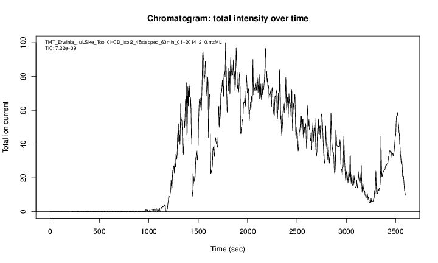
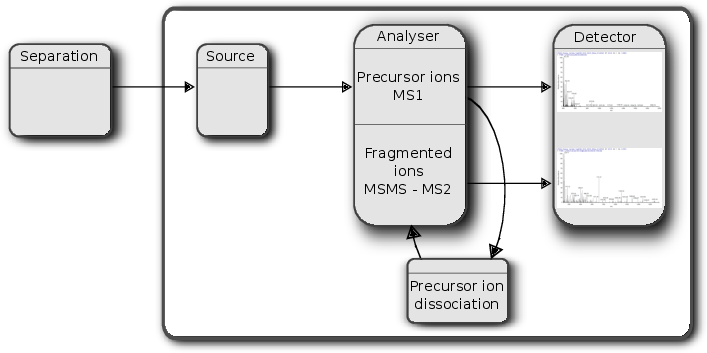
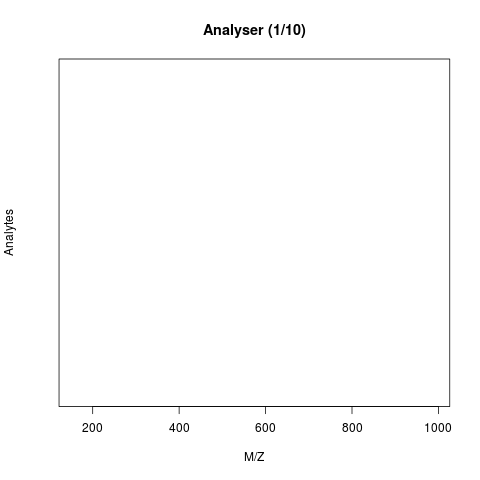
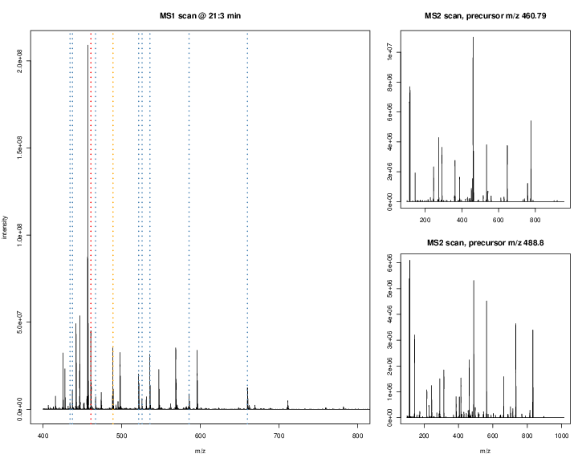
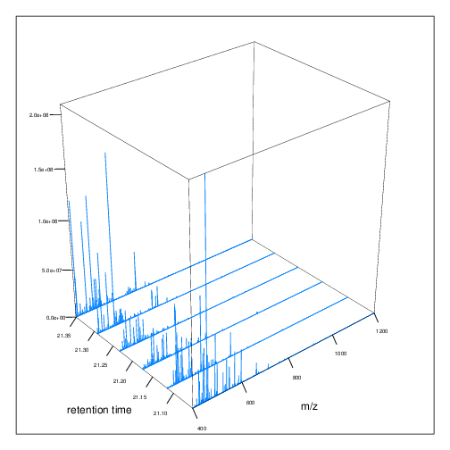
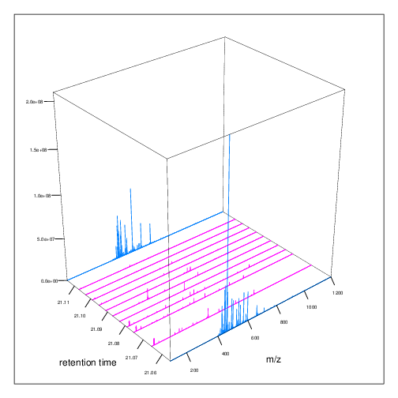

# 1  Introduction

## 1.1 How does mass spectrometry work?

Mass spectrometry (MS) is a technology that *separates* charged molecules (ions) based on their mass to charge ratio (M/Z). It is often coupled to chromatography (liquid LC, but can also be gas-based GC). The time an analyte takes to elute from the chromatography column is the *retention time*.



A chromatogram, illustrating the total amount of analytes over the retention time.

An mass spectrometer is composed of three components:

1.  The *source*, that ionises the molecules: examples are Matrix-assisted laser desorption/ionisation (MALDI) or electrospray ionisation. (ESI)
2.  The *analyser*, that separates the ions: Time of flight (TOF) or Orbitrap.
3.  The *detector* that quantifies the ions.

When using mass spectrometry for proteomics, the proteins are first digested with a protease such as trypsin. In mass shotgun proteomics, the analytes assayed in the mass spectrometer are peptides.

Often, ions are subjected to more than a single MS round. After a first round of separation, the peaks in the spectra, called MS1 spectra, represent peptides. At this stage, the only information we possess about these peptides are their retention time and their mass-to-charge (we can also infer their charge by inspecting their isotopic envelope, i.e the peaks of the individual isotopes, see below), which is not enough to infer their identify (i.e. their sequence).

In MSMS (or MS2), the settings of the mass spectrometer are set automatically to select a certain number of MS1 peaks (for example 20)[^1]. Once a narrow M/Z range has been selected (corresponding to one high-intensity peak, a peptide, and some background noise), it is fragmented (using for example collision-induced dissociation (CID), higher energy collisional dissociation (HCD) or electron-transfer dissociation (ETD)). The fragment ions are then themselves separated in the analyser to produce a MS2 spectrum. The unique fragment ion pattern can then be used to infer the peptide sequence using de novo sequencing (when the spectrum is of high enough quality) or using a search engine such as, for example Mascot, MSGF+, …, that will match the observed, experimental spectrum to theoretical spectra (see details below).



Schematics of a mass spectrometer and two rounds of MS.

The animation below show how 25 ions different ions (i.e. having different M/Z values) are separated throughout the MS analysis and are eventually detected (i.e. quantified). The final frame shows the hypothetical spectrum.



Separation and detection of ions in a mass spectrometer.

The figures below illustrate the two rounds of MS. The spectrum on the left is an MS1 spectrum acquired after 21 minutes and 3 seconds of elution. 10 peaks, highlited by dotted vertical lines, were selected for MS2 analysis. The peak at M/Z 460.79 (488.8) is highlighted by a red (orange) vertical line on the MS1 spectrum and the fragment spectra are shown on the MS2 spectrum on the top (bottom) right figure.



Parent ions in the MS1 spectrum (left) and two sected fragment ions MS2 spectra (right)

The figures below represent the 3 dimensions of MS data: a set of spectra (M/Z and intensity) of retention time, as well as the interleaved nature of MS1 and MS2 (and there could be more levels) data.



MS1 spectra over retention time.



MS2 spectra interleaved between two MS1 spectra.

## 1.2 Accessing data

### From the ProteomeXchange database

MS-based proteomics data is disseminated through the [ProteomeXchange](http://www.proteomexchange.org/) infrastructure, which centrally coordinates submission, storage and dissemination through multiple data repositories, such as the [PRoteomics IDEntifications (PRIDE)](https://www.ebi.ac.uk/pride/archive/) database at the EBI for mass spectrometry-based experiments (including quantitative data, as opposed as the name suggests), [PASSEL](http://www.peptideatlas.org/passel/) at the ISB for Selected Reaction Monitoring (SRM, i.e. targeted) data and the [MassIVE](http://massive.ucsd.edu/ProteoSAFe/static/massive.jsp) resource. These data can be downloaded within R using the *[rpx](https://bioconductor.org/packages/3.24/rpx)* package.

``` downlit
library("rpx")
##  OpenTelemetry error: there is no package called 'otelsdk'
##  OpenTelemetry error: there is no package called 'otelsdk'
```

Using the unique `PXD000001` identifier, we can retrieve the relevant metadata that will be stored in a `PXDataset` object. The names of the files available in this data can be retrieved with the `pxfiles` accessor function.

``` downlit
px <- PXDataset("PXD000001")
##  Loading PXD000001 from cache.
px
##  Project PXD000001 with 12 files
##  
##  Resource ID BFC1 in cache in /opt/R-cache/R/rpx.
##   [1] 'F063721.dat' ... [12] 'erwinia_carotovora.fasta'
##   Use 'pxfiles(.)' to see all files.
pxfiles(px)
##  Project PXD000001 files (12):
##   [remote] F063721.dat
##   [remote] F063721.dat-mztab.txt
##   [remote] PRIDE_Exp_Complete_Ac_22134.xml.gz
##   [remote] PRIDE_Exp_mzData_Ac_22134.xml.gz
##   [remote] PXD000001_community_annotated.sdrf.tsv
##   [remote] PXD000001_mztab.txt
##   [remote] README.txt
##   [local]  TMT_Erwinia_1uLSike_Top10HCD_isol2_45stepped_60min_01-20141210.mzML
##   [remote] TMT_Erwinia_1uLSike_Top10HCD_isol2_45stepped_60min_01-20141210.mzXML
##   [remote] TMT_Erwinia_1uLSike_Top10HCD_isol2_45stepped_60min_01.mzXML
##   ...
```

Other metadata for the `px` data set:

``` downlit
pxtax(px)
##  [1] "Erwinia carotovora"
pxurl(px)
##  [1] "ftp://ftp.pride.ebi.ac.uk/pride/data/archive/2012/03/PXD000001"
pxref(px)
##  [1] "Gatto L, Christoforou A; Using R and Bioconductor for proteomics data analysis., Biochim Biophys Acta, 2013 May 18, doi:10.1016/j.bbapap.2013.04.032 PMID:NA"
```

Data files can then be downloaded with the `pxget` function. Below, we retrieve the raw data file. The file is downloaded[^2] in the working directory and the name of the file is return by the

function and stored in the `mzf` variable for later use [^3].

``` downlit
fn <- "TMT_Erwinia_1uLSike_Top10HCD_isol2_45stepped_60min_01-20141210.mzML"
mzf <- pxget(px, fn)
##  Loading TMT_Erwinia_1uLSike_Top10HCD_isol2_45stepped_60min_01-20141210.mzML from cache.
mzf
##  [1] "/opt/R-cache/R/rpx/853174f95_TMT_Erwinia_1uLSike_Top10HCD_isol2_45stepped_60min_01-20141210.mzML"
```

### Data hub

The Bioconductor project had dedicated data hubs for experiment and annotation data. Data that is accessed through these hubs are cached centrally to avoid repeated downloads.

The *[MsDataHub](https://bioconductor.org/packages/3.24/MsDataHub)* package provides data for mass spectrometry in general, and proteomics in particular. Once loaded, the [`MsDataHub()`](https://rformassspectrometry.github.io/MsDataHub/reference/MsDataHub.html) function lists the available datasets

``` downlit
library("MsDataHub")
MsDataHub()
##                                                                      Title
##  1                                                                ko15.CDF
##  2                                                cptac_a_b_c_peptides.txt
##  3                                                  cptac_a_b_peptides.txt
##  4                                                      cptac_peptides.txt
##  5     TMT_Erwinia_1uLSike_Top10HCD_isol2_45stepped_60min_01.20141210.mzid
##  6  TMT_Erwinia_1uLSike_Top10HCD_isol2_45stepped_60min_01.20141210.mzML.gz
##  7                                       X20171016_POOL_POS_1_105.134.mzML
##  8                                       X20171016_POOL_POS_3_105.134.mzML
##  9                                                       PestMix1_DDA.mzML
##  10                                                    PestMix1_SWATH.mzML
##  11                                                    benchmarkingDIA.tsv
##  12                                           Report.Derks2022.plexDIA.tsv
##  13                                                 Ai2025_aCMs_report.tsv
##  14                                                 Ai2025_iCMs_report.tsv
##  15                                                         crap_gpm.fasta
##  16                                                         crap_ccp.fasta
##  17                                                 crap_maxquant.fasta.gz
##  18                                                        CEMS_10ppm.mzML
##  19                                                        CEMS_25ppm.mzML
##  20                             HAM004_641fE_14.11.07..Exp1.extracted.mzML
##  21                             HAM004_641fE_14.11.07..Exp2.extracted.mzML
##  22                             HAM004_641fE_14.11.07..Exp3.extracted.mzML
##  23                             HAM004_641fE_14.11.07..Exp4.extracted.mzML
##  24                             HAM004_641fE_14.11.07..Exp5.extracted.mzML
##  25                             HAM005_641fE_14.11.07..Exp1.extracted.mzML
##  26                             HAM005_641fE_14.11.07..Exp2.extracted.mzML
##  27                             HAM005_641fE_14.11.07..Exp3.extracted.mzML
##  28                             HAM005_641fE_14.11.07..Exp4.extracted.mzML
##  29                             HAM005_641fE_14.11.07..Exp5.extracted.mzML
##  30                                                    MRM.standmix.5.mzML
##  31                                                          MS3TMT11.mzML
##  32                                  MS3TMT10_01022016_32917.33481.mzML.gz
##  33                                                         fdms3tmt11.rda
##  34                                                  D19_15um30cm_SC1.mzML
##  35                                   OR11_20160122_PG_HeLa_CVB3_CT_A.mzML
##  36                                              D19_15um30cm_SC1.sage.tsv
##  37                               OR11_20160122_PG_HeLa_CVB3_CT_A.sage.tsv
##  38                                                               ko16.CDF
##  39                                                               ko18.CDF
##  40                                                               ko19.CDF
##  41                                                               ko21.CDF
##  42                                                               ko22.CDF
##  43                                                               wt15.CDF
##  44                                                               wt16.CDF
##  45                                                               wt18.CDF
##  46                                                               wt19.CDF
##  47                                                               wt21.CDF
##  48                                                               wt22.CDF
##  49                   Christoforou_2016_TMT_DDA_FragPipe_Fraction1_psm.tsv
##  50                   Christoforou_2016_TMT_DDA_FragPipe_Fraction2_psm.tsv
##  51                        Christoforou_2016_TMT_DDA_MaxQuant_evidence.txt
##  52                        Christoforou_2016_TMT_DDA_sage_results.sage.tsv
##  53                                 Christoforou_2016_TMT_DDA_sage_tmt.tsv
##  54                            Derks_2022_plex_DIA_DIANN_report_subset.tsv
##  55                          vanPuyvelde_2022_LFQ_DDA_FragPipe_A_1_psm.tsv
##  56                          vanPuyvelde_2022_LFQ_DDA_FragPipe_A_2_psm.tsv
##  57                          vanPuyvelde_2022_LFQ_DDA_FragPipe_A_3_psm.tsv
##  58                          vanPuyvelde_2022_LFQ_DDA_FragPipe_B_1_psm.tsv
##  59                          vanPuyvelde_2022_LFQ_DDA_FragPipe_B_2_psm.tsv
##  60                          vanPuyvelde_2022_LFQ_DDA_FragPipe_B_3_psm.tsv
##  61                         vanPuyvelde_2022_LFQ_DDA_MaxQuant_evidence.txt
##  62                         vanPuyvelde_2022_LFQ_DDA_MaxQuant_peptides.txt
##  63                    vanPuyvelde_2022_LFQ_DDA_MaxQuant_proteinGroups.txt
##  64                          vanPuyvelde_2022_LFQ_DDA_PEAKS_LFQ_report.csv
##  65                                  vanPuyvelde_2022_LFQ_DDA_sage_lfq.tsv
##  66                         vanPuyvelde_2022_LFQ_DDA_sage_results.sage.tsv
##  67                          vanPuyvelde_2022_LFQ_DIA_DIANN_report.parquet
##  68                              vanPuyvelde_2022_LFQ_DIA_DIANN_report.tsv
##                                                                                                                                   Description
##  1  Saghatelian et al. (2004) FAAH knockout LC/MS data. Raw metabolomics MS file in netCDF format. KO 15 sample. See ?faahKO.CDF for details.
##  2                            Conditions A, B and C of the CPTAC quantitative proteomics data (tab-delimited format). See ?cptac for details.
##  3                               Conditions A and B of the CPTAC quantitative proteomics data (tab-delimited format). See ?cptac for details.
##  4                                                         CPTAC quantitative proteomics data (tab-delimited format). See ?cptac for details.
##  5                                                        Peptide spectrum matches from the PDX000001 experiment. See ?PXD000001 for details.
##  6                                                     Raw MS data from the PDX000001 experiment, in mzML format. See ?PXD000001 for details.
##  7                                                      AB Sciex LC-MS data file (injection index 1), in mzML format. See ?sciex for details.
##  8                                                     AB Sciex LC-MS data file (injection index 19), in mzML format. See ?sciex for details.
##  9                                                                       Triple TOF DDA raw data, in mzML format. See ?TripleTOF for details.
##  10                                                                    Triple TOF SWATH raw data, in mzML format. See ?TripleTOF for details.
##  11                                                                                                    Output of DIA-NN software (report.tsv)
##  12                                                            Derk et al. (2022) single-cell proteomics plexDIA results (DIA-NN report.tsv).
##  13   Ai et al. (2025) Single Cell Proteomics Reveals Specific Cellular Subtypes in Cardiomyocytes Derived from Human iPSCs and Adult Hearts.
##  14   Ai et al. (2025) Single Cell Proteomics Reveals Specific Cellular Subtypes in Cardiomyocytes Derived from Human iPSCs and Adult Hearts.
##  15                                                  common Repository of Adventitious Proteins (cRAP) from the Global Proteome Machine (GPM)
##  16                                          common Repository of Adventitious Proteins (cRAP) from the Cambridge Centre for Proteomics (CCP)
##  17                                                                                                           MaxQuant's contaminant database
##  18                                                                           CE-MS data file (10ppm), in mzML format. See ?CEMS for details.
##  19                                                                            CE-MS data file (25ppm) in mzML format. See ?CEMS for details.
##  20                                                               FTICR-MS data file HAM4, experiment 1, in mzML file. See ?FTICR for details
##  21                                                               FTICR-MS data file HAM4, experiment 2, in mzML file. See ?FTICR for details
##  22                                                               FTICR-MS data file HAM4, experiment 3, in mzML file. See ?FTICR for details
##  23                                                               FTICR-MS data file HAM4, experiment 4, in mzML file. See ?FTICR for details
##  24                                                               FTICR-MS data file HAM4, experiment 5, in mzML file. See ?FTICR for details
##  25                                                               FTICR-MS data file HAM5, experiment 1, in mzML file. See ?FTICR for details
##  26                                                               FTICR-MS data file HAM5, experiment 2, in mzML file. See ?FTICR for details
##  27                                                               FTICR-MS data file HAM5, experiment 3, in mzML file. See ?FTICR for details
##  28                                                               FTICR-MS data file HAM5, experiment 4, in mzML file. See ?FTICR for details
##  29                                                               FTICR-MS data file HAM5, experiment 5, in mzML file. See ?FTICR for details
##  30                                               Multiple Reaction Monitoring mode (MRM) file from a mouse brain sample. See ?MRM fo details
##  31                                                        A subset of 994 spectra from a currenly unpublished MS3 SPS TMT 11-plex experiment
##  32                                                        A subset of 565 spectra from a currenly unpublished MS3 SPS TMT 10-plex experiment
##  33                                                                                                         Feature data of the MS3TMT11 data
##  34                                                                        Boekweg et al. (2022) SCP mzML file. See ?Boekweg2022 for details.
##  35                                                                       Boekweg et al. (2022) bulk mzML file. See ?Boekweg2022 for details.
##  36                                                       Boekweg et al. (2022) Sage PSMs for D19_15um30cm_SC1. See ?Boekweg2022 for details.
##  37                                        Boekweg et al. (2022) Sage PSMs for OR11_20160122_PG_HeLa_CVB3_CT_A. See ?Boekweg2022 for details.
##  38     Saghatelian et al. (2004) FAAH knockout LC/MS data. Raw metabolomics MS file in netCDF format. KO 16 sample. See ?faahKO for details.
##  39     Saghatelian et al. (2004) FAAH knockout LC/MS data. Raw metabolomics MS file in netCDF format. KO 18 sample. See ?faahKO for details.
##  40     Saghatelian et al. (2004) FAAH knockout LC/MS data. Raw metabolomics MS file in netCDF format. KO 19 sample. See ?faahKO for details.
##  41     Saghatelian et al. (2004) FAAH knockout LC/MS data. Raw metabolomics MS file in netCDF format. KO 21 sample. See ?faahKO for details.
##  42     Saghatelian et al. (2004) FAAH knockout LC/MS data. Raw metabolomics MS file in netCDF format. KO 22 sample. See ?faahKO for details.
##  43     Saghatelian et al. (2004) FAAH knockout LC/MS data. Raw metabolomics MS file in netCDF format. WT 15 sample. See ?faahKO for details.
##  44     Saghatelian et al. (2004) FAAH knockout LC/MS data. Raw metabolomics MS file in netCDF format. WT 16 sample. See ?faahKO for details.
##  45     Saghatelian et al. (2004) FAAH knockout LC/MS data. Raw metabolomics MS file in netCDF format. WT 18 sample. See ?faahKO for details.
##  46     Saghatelian et al. (2004) FAAH knockout LC/MS data. Raw metabolomics MS file in netCDF format. WT 19 sample. See ?faahKO for details.
##  47     Saghatelian et al. (2004) FAAH knockout LC/MS data. Raw metabolomics MS file in netCDF format. WT 21 sample. See ?faahKO for details.
##  48     Saghatelian et al. (2004) FAAH knockout LC/MS data. Raw metabolomics MS file in netCDF format. WT 22 sample. See ?faahKO for details.
##  49                                                                        Various DDA and DIA files to illustrate QFeatures::readQFeatures()
##  50                                                                        Various DDA and DIA files to illustrate QFeatures::readQFeatures()
##  51                                                                        Various DDA and DIA files to illustrate QFeatures::readQFeatures()
##  52                                                                        Various DDA and DIA files to illustrate QFeatures::readQFeatures()
##  53                                                                        Various DDA and DIA files to illustrate QFeatures::readQFeatures()
##  54                                                                        Various DDA and DIA files to illustrate QFeatures::readQFeatures()
##  55                                                                        Various DDA and DIA files to illustrate QFeatures::readQFeatures()
##  56                                                                        Various DDA and DIA files to illustrate QFeatures::readQFeatures()
##  57                                                                        Various DDA and DIA files to illustrate QFeatures::readQFeatures()
##  58                                                                        Various DDA and DIA files to illustrate QFeatures::readQFeatures()
##  59                                                                        Various DDA and DIA files to illustrate QFeatures::readQFeatures()
##  60                                                                        Various DDA and DIA files to illustrate QFeatures::readQFeatures()
##  61                                                                        Various DDA and DIA files to illustrate QFeatures::readQFeatures()
##  62                                                                        Various DDA and DIA files to illustrate QFeatures::readQFeatures()
##  63                                                                        Various DDA and DIA files to illustrate QFeatures::readQFeatures()
##  64                                                                        Various DDA and DIA files to illustrate QFeatures::readQFeatures()
##  65                                                                        Various DDA and DIA files to illustrate QFeatures::readQFeatures()
##  66                                                                        Various DDA and DIA files to illustrate QFeatures::readQFeatures()
##  67                                                                        Various DDA and DIA files to illustrate QFeatures::readQFeatures()
##  68                                                                        Various DDA and DIA files to illustrate QFeatures::readQFeatures()
##     BiocVersion Genome SourceType
##  1         3.17     NA        CDF
##  2         3.17     NA        TXT
##  3         3.17     NA        TXT
##  4         3.17     NA        TXT
##  5         3.17     NA       mzid
##  6         3.17     NA       mzML
##  7         3.17     NA       mzML
##  8         3.17     NA       mzML
##  9         3.17     NA       mzML
##  10        3.17     NA       mzML
##  11        3.17     NA        TSV
##  12        3.19     NA        TSV
##  13        3.21     NA        TSV
##  14        3.21     NA        TSV
##  15        3.21     NA      FASTA
##  16        3.21     NA      FASTA
##  17        3.21     NA      FASTA
##  18        3.23     NA       mzML
##  19        3.23     NA       mzML
##  20        3.23     NA       mzML
##  21        3.23     NA       mzML
##  22        3.23     NA       mzML
##  23        3.23     NA       mzML
##  24        3.23     NA       mzML
##  25        3.23     NA       mzML
##  26        3.23     NA       mzML
##  27        3.23     NA       mzML
##  28        3.23     NA       mzML
##  29        3.23     NA       mzML
##  30        3.23     NA       mzML
##  31        3.23     NA       mzML
##  32        3.23     NA       mzML
##  33        3.23     NA        RDA
##  34        3.23     NA       mzML
##  35        3.23     NA       mzML
##  36        3.23     NA        TSV
##  37        3.23     NA        TSV
##  38        3.23     NA        CDF
##  39        3.23     NA        CDF
##  40        3.23     NA        CDF
##  41        3.23     NA        CDF
##  42        3.23     NA        CDF
##  43        3.23     NA        CDF
##  44        3.23     NA        CDF
##  45        3.23     NA        CDF
##  46        3.23     NA        CDF
##  47        3.23     NA        CDF
##  48        3.23     NA        CDF
##  49        3.23     NA        TSV
##  50        3.23     NA        TSV
##  51        3.23     NA        TXT
##  52        3.23     NA        TSV
##  53        3.23     NA        TSV
##  54        3.23     NA        TSV
##  55        3.23     NA        TSV
##  56        3.23     NA        TSV
##  57        3.23     NA        TSV
##  58        3.23     NA        TSV
##  59        3.23     NA        TSV
##  60        3.23     NA        TSV
##  61        3.23     NA        TXT
##  62        3.23     NA        TXT
##  63        3.23     NA        TXT
##  64        3.23     NA        CSV
##  65        3.23     NA        TSV
##  66        3.23     NA        TSV
##  67        3.23     NA    Parquet
##  68        3.23     NA        TSV
##                                                                                                            SourceUrl
##  1                                                                https://zenodo.org/records/19606563/files/ko15.CDF
##  2                                          https://uclouvain-cbio.github.io/WSBIM2122/data/cptac_a_b_c_peptides.txt
##  3                                           https://bioconductor.org/packages/3.16/data/experiment/html/msdata.html
##  4  https://raw.githubusercontent.com/statOmics/PDA/data/quantification/fullCptacDatasSetNotForTutorial/peptides.txt
##  5                                           https://bioconductor.org/packages/3.16/data/experiment/html/msdata.html
##  6                                                 https://ftp.pride.ebi.ac.uk/pride/data/archive/2012/03/PXD000001/
##  7                                        https://zenodo.org/records/20729183/files/20171016_POOL_POS_1_105-134.mzML
##  8                                        https://zenodo.org/records/20729183/files/20171016_POOL_POS_3_105-134.mzML
##  9                                                       https://zenodo.org/records/20729093/files/PestMix1_DDA.mzML
##  10                                                    https://zenodo.org/records/20729093/files/PestMix1_SWATH.mzML
##  11                                                                               https://zenodo.org/records/8063173
##  12                                         https://drive.google.com/drive/folders/1pUC2zgXKtKYn22mlor0lmUDK0frgwL_-
##  13                                                 https://zenodo.org/records/21900721/files/Ai2025_aCMs_report.tsv
##  14                                                 https://zenodo.org/records/21900721/files/Ai2025_iCMs_report.tsv
##  15                                                         https://zenodo.org/records/15115102/files/crap_gpm.fasta
##  16                                                         https://zenodo.org/records/15115102/files/crap_ccp.fasta
##  17                                                 https://zenodo.org/records/15115102/files/crap_maxquant.fasta.gz
##  18                                                        https://zenodo.org/records/18481720/files/CEMS_10ppm.mzML
##  19                                                        https://zenodo.org/records/18481720/files/CEMS_25ppm.mzML
##  20                             https://zenodo.org/records/18494294/files/HAM004_641fE_14-11-07--Exp1.extracted.mzML
##  21                             https://zenodo.org/records/18494294/files/HAM004_641fE_14-11-07--Exp2.extracted.mzML
##  22                             https://zenodo.org/records/18494294/files/HAM004_641fE_14-11-07--Exp3.extracted.mzML
##  23                             https://zenodo.org/records/18494294/files/HAM004_641fE_14-11-07--Exp4.extracted.mzML
##  24                             https://zenodo.org/records/18494294/files/HAM004_641fE_14-11-07--Exp5.extracted.mzML
##  25                             https://zenodo.org/records/18494294/files/HAM005_641fE_14-11-07--Exp1.extracted.mzML
##  26                             https://zenodo.org/records/18494294/files/HAM005_641fE_14-11-07--Exp2.extracted.mzML
##  27                             https://zenodo.org/records/18494294/files/HAM005_641fE_14-11-07--Exp3.extracted.mzML
##  28                             https://zenodo.org/records/18494294/files/HAM005_641fE_14-11-07--Exp4.extracted.mzML
##  29                             https://zenodo.org/records/18494294/files/HAM005_641fE_14-11-07--Exp5.extracted.mzML
##  30                                                    https://zenodo.org/records/18502866/files/MRM-standmix-5.mzML
##  31                                                          https://zenodo.org/records/19127509/files/MS3TMT11.mzML
##  32                                  https://zenodo.org/records/19127509/files/MS3TMT10_01022016_32917-33481.mzML.gz
##  33                                                         https://zenodo.org/records/19127509/files/fdms3tmt11.rda
##  34                                                  https://zenodo.org/records/21900721/files/D19_15um30cm_SC1.mzML
##  35                                   https://zenodo.org/records/21900721/files/OR11_20160122_PG_HeLa_CVB3_CT_A.mzML
##  36                                              https://zenodo.org/records/19370231/files/D19_15um30cm_SC1.sage.tsv
##  37                               https://zenodo.org/records/19370231/files/OR11_20160122_PG_HeLa_CVB3_CT_A.sage.tsv
##  38                                                               https://zenodo.org/records/19606563/files/ko16.CDF
##  39                                                               https://zenodo.org/records/19606563/files/ko18.CDF
##  40                                                               https://zenodo.org/records/19606563/files/ko19.CDF
##  41                                                               https://zenodo.org/records/19606563/files/ko21.CDF
##  42                                                               https://zenodo.org/records/19606563/files/ko22.CDF
##  43                                                               https://zenodo.org/records/19606563/files/wt15.CDF
##  44                                                               https://zenodo.org/records/19606563/files/wt16.CDF
##  45                                                               https://zenodo.org/records/19606563/files/wt18.CDF
##  46                                                               https://zenodo.org/records/19606563/files/wt19.CDF
##  47                                                               https://zenodo.org/records/19606563/files/wt21.CDF
##  48                                                               https://zenodo.org/records/19606563/files/wt22.CDF
##  49                   https://zenodo.org/records/19137577/files/Christoforou_2016_TMT_DDA_FragPipe_Fraction1_psm.tsv
##  50                   https://zenodo.org/records/19137577/files/Christoforou_2016_TMT_DDA_FragPipe_Fraction2_psm.tsv
##  51                        https://zenodo.org/records/19137577/files/Christoforou_2016_TMT_DDA_MaxQuant_evidence.txt
##  52                        https://zenodo.org/records/19137577/files/Christoforou_2016_TMT_DDA_sage_results.sage.tsv
##  53                                 https://zenodo.org/records/19137577/files/Christoforou_2016_TMT_DDA_sage_tmt.tsv
##  54                                   https://zenodo.org/records/19137577/files/Derks_2022_plex_DIA_DIANN_report.tsv
##  55                          https://zenodo.org/records/19137577/files/vanPuyvelde_2022_LFQ_DDA_FragPipe_A_1_psm.tsv
##  56                          https://zenodo.org/records/19137577/files/vanPuyvelde_2022_LFQ_DDA_FragPipe_A_2_psm.tsv
##  57                          https://zenodo.org/records/19137577/files/vanPuyvelde_2022_LFQ_DDA_FragPipe_A_3_psm.tsv
##  58                          https://zenodo.org/records/19137577/files/vanPuyvelde_2022_LFQ_DDA_FragPipe_B_1_psm.tsv
##  59                          https://zenodo.org/records/19137577/files/vanPuyvelde_2022_LFQ_DDA_FragPipe_B_2_psm.tsv
##  60                          https://zenodo.org/records/19137577/files/vanPuyvelde_2022_LFQ_DDA_FragPipe_B_3_psm.tsv
##  61                         https://zenodo.org/records/19137577/files/vanPuyvelde_2022_LFQ_DDA_MaxQuant_evidence.txt
##  62                         https://zenodo.org/records/19137577/files/vanPuyvelde_2022_LFQ_DDA_MaxQuant_peptides.txt
##  63                    https://zenodo.org/records/19137577/files/vanPuyvelde_2022_LFQ_DDA_MaxQuant_proteinGroups.txt
##  64                          https://zenodo.org/records/19137577/files/vanPuyvelde_2022_LFQ_DDA_PEAKS_LFQ_report.csv
##  65                                  https://zenodo.org/records/19137577/files/vanPuyvelde_2022_LFQ_DDA_sage_lfq.tsv
##  66                         https://zenodo.org/records/19137577/files/vanPuyvelde_2022_LFQ_DDA_sage_results.sage.tsv
##  67                          https://zenodo.org/records/19137577/files/vanPuyvelde_2022_LFQ_DIA_DIANN_report.parquet
##  68                              https://zenodo.org/records/19137577/files/vanPuyvelde_2022_LFQ_DIA_DIANN_report.tsv
##     SourceVersion                  Species TaxonomyId Coordinate_1_based
##  1              1             Mus musculus      10090                 NA
##  2              1 Saccharomyces cerevisiae       4932                 NA
##  3              1 Saccharomyces cerevisiae       4932                 NA
##  4              1 Saccharomyces cerevisiae       4932                 NA
##  5              1       Erwinia carotovora        554                 NA
##  6              1       Erwinia carotovora        554                 NA
##  7              1             Homo sapiens       9606                 NA
##  8              1             Homo sapiens       9606                 NA
##  9              1                                  NA                 NA
##  10             1                                  NA                 NA
##  11             1             Homo sapiens       9606                 NA
##  12             1             Homo sapiens       9606                 NA
##  13             1             Homo sapiens       9606                 NA
##  14             1             Homo sapiens       9606                 NA
##  15             1                                  NA                 NA
##  16             1                                  NA                 NA
##  17             1                                  NA                 NA
##  18             1                                  NA                 NA
##  19             1                                  NA                 NA
##  20             1                                  NA                 NA
##  21             1                                  NA                 NA
##  22             1                                  NA                 NA
##  23             1                                  NA                 NA
##  24             1                                  NA                 NA
##  25             1                                  NA                 NA
##  26             1                                  NA                 NA
##  27             1                                  NA                 NA
##  28             1                                  NA                 NA
##  29             1                                  NA                 NA
##  30             1             Mus musculus      10090                 NA
##  31             1                                  NA                 NA
##  32             1                                  NA                 NA
##  33             1                                  NA                 NA
##  34             1             Homo sapiens       9606                 NA
##  35             1             Homo sapiens       9606                 NA
##  36             1             Homo sapiens       9606                 NA
##  37             1             Homo sapiens       9606                 NA
##  38             1             Mus musculus      10090                 NA
##  39             1             Mus musculus      10090                 NA
##  40             1             Mus musculus      10090                 NA
##  41             1             Mus musculus      10090                 NA
##  42             1             Mus musculus      10090                 NA
##  43             1             Mus musculus      10090                 NA
##  44             1             Mus musculus      10090                 NA
##  45             1             Mus musculus      10090                 NA
##  46             1             Mus musculus      10090                 NA
##  47             1             Mus musculus      10090                 NA
##  48             1             Mus musculus      10090                 NA
##  49             1             Mus musculus      10090                 NA
##  50             1             Mus musculus      10090                 NA
##  51             1             Mus musculus      10090                 NA
##  52             1             Mus musculus      10090                 NA
##  53             1             Mus musculus      10090                 NA
##  54             1                     <NA>         NA                 NA
##  55             1                     <NA>         NA                 NA
##  56             1                     <NA>         NA                 NA
##  57             1                     <NA>         NA                 NA
##  58             1                     <NA>         NA                 NA
##  59             1                     <NA>         NA                 NA
##  60             1                     <NA>         NA                 NA
##  61             1                     <NA>         NA                 NA
##  62             1                     <NA>         NA                 NA
##  63             1                     <NA>         NA                 NA
##  64             1                     <NA>         NA                 NA
##  65             1                     <NA>         NA                 NA
##  66             1                     <NA>         NA                 NA
##  67             1                     <NA>         NA                 NA
##  68             1                     <NA>         NA                 NA
##     DataProvider                                 Maintainer  RDataClass
##  1            NA Laurent Gatto <laurent.gatto@uclouvain.be>     Spectra
##  2            NA Laurent Gatto <laurent.gatto@uclouvain.be>  data.frame
##  3            NA Laurent Gatto <laurent.gatto@uclouvain.be>  data.frame
##  4            NA Laurent Gatto <laurent.gatto@uclouvain.be>  data.frame
##  5            NA Laurent Gatto <laurent.gatto@uclouvain.be>     Spectra
##  6            NA Laurent Gatto <laurent.gatto@uclouvain.be>         PSM
##  7            NA Laurent Gatto <laurent.gatto@uclouvain.be>     Spectra
##  8            NA Laurent Gatto <laurent.gatto@uclouvain.be>     Spectra
##  9            NA Laurent Gatto <laurent.gatto@uclouvain.be>     Spectra
##  10           NA Laurent Gatto <laurent.gatto@uclouvain.be>     Spectra
##  11           NA Laurent Gatto <laurent.gatto@uclouvain.be>  data.frame
##  12           NA Laurent Gatto <laurent.gatto@uclouvain.be>  data.frame
##  13           NA Laurent Gatto <laurent.gatto@uclouvain.be>  data.frame
##  14           NA Laurent Gatto <laurent.gatto@uclouvain.be>  data.frame
##  15           NA Laurent Gatto <laurent.gatto@uclouvain.be> AAStringSet
##  16           NA Laurent Gatto <laurent.gatto@uclouvain.be> AAStringSet
##  17           NA Laurent Gatto <laurent.gatto@uclouvain.be> AAStringSet
##  18           NA Laurent Gatto <laurent.gatto@uclouvain.be>     Spectra
##  19           NA Laurent Gatto <laurent.gatto@uclouvain.be>     Spectra
##  20           NA Laurent Gatto <laurent.gatto@uclouvain.be>     Spectra
##  21           NA Laurent Gatto <laurent.gatto@uclouvain.be>     Spectra
##  22           NA Laurent Gatto <laurent.gatto@uclouvain.be>     Spectra
##  23           NA Laurent Gatto <laurent.gatto@uclouvain.be>     Spectra
##  24           NA Laurent Gatto <laurent.gatto@uclouvain.be>     Spectra
##  25           NA Laurent Gatto <laurent.gatto@uclouvain.be>     Spectra
##  26           NA Laurent Gatto <laurent.gatto@uclouvain.be>     Spectra
##  27           NA Laurent Gatto <laurent.gatto@uclouvain.be>     Spectra
##  28           NA Laurent Gatto <laurent.gatto@uclouvain.be>     Spectra
##  29           NA Laurent Gatto <laurent.gatto@uclouvain.be>     Spectra
##  30           NA Laurent Gatto <laurent.gatto@uclouvain.be>     Spectra
##  31           NA Laurent Gatto <laurent.gatto@uclouvain.be>     Spectra
##  32           NA Laurent Gatto <laurent.gatto@uclouvain.be>     Spectra
##  33           NA Laurent Gatto <laurent.gatto@uclouvain.be>  data.frame
##  34           NA Laurent Gatto <laurent.gatto@uclouvain.be>     Spectra
##  35           NA Laurent Gatto <laurent.gatto@uclouvain.be>     Spectra
##  36           NA Laurent Gatto <laurent.gatto@uclouvain.be>  data.frame
##  37           NA Laurent Gatto <laurent.gatto@uclouvain.be>  data.frame
##  38           NA Laurent Gatto <laurent.gatto@uclouvain.be>     Spectra
##  39           NA Laurent Gatto <laurent.gatto@uclouvain.be>     Spectra
##  40           NA Laurent Gatto <laurent.gatto@uclouvain.be>     Spectra
##  41           NA Laurent Gatto <laurent.gatto@uclouvain.be>     Spectra
##  42           NA Laurent Gatto <laurent.gatto@uclouvain.be>     Spectra
##  43           NA Laurent Gatto <laurent.gatto@uclouvain.be>     Spectra
##  44           NA Laurent Gatto <laurent.gatto@uclouvain.be>     Spectra
##  45           NA Laurent Gatto <laurent.gatto@uclouvain.be>     Spectra
##  46           NA Laurent Gatto <laurent.gatto@uclouvain.be>     Spectra
##  47           NA Laurent Gatto <laurent.gatto@uclouvain.be>     Spectra
##  48           NA Laurent Gatto <laurent.gatto@uclouvain.be>     Spectra
##  49           NA Laurent Gatto <laurent.gatto@uclouvain.be>  data.frame
##  50           NA Laurent Gatto <laurent.gatto@uclouvain.be>  data.frame
##  51           NA Laurent Gatto <laurent.gatto@uclouvain.be>  data.frame
##  52           NA Laurent Gatto <laurent.gatto@uclouvain.be>  data.frame
##  53           NA Laurent Gatto <laurent.gatto@uclouvain.be>  data.frame
##  54           NA Laurent Gatto <laurent.gatto@uclouvain.be>  data.frame
##  55           NA Laurent Gatto <laurent.gatto@uclouvain.be>  data.frame
##  56           NA Laurent Gatto <laurent.gatto@uclouvain.be>  data.frame
##  57           NA Laurent Gatto <laurent.gatto@uclouvain.be>  data.frame
##  58           NA Laurent Gatto <laurent.gatto@uclouvain.be>  data.frame
##  59           NA Laurent Gatto <laurent.gatto@uclouvain.be>  data.frame
##  60           NA Laurent Gatto <laurent.gatto@uclouvain.be>  data.frame
##  61           NA Laurent Gatto <laurent.gatto@uclouvain.be>  data.frame
##  62           NA Laurent Gatto <laurent.gatto@uclouvain.be>  data.frame
##  63           NA Laurent Gatto <laurent.gatto@uclouvain.be>  data.frame
##  64           NA Laurent Gatto <laurent.gatto@uclouvain.be>  data.frame
##  65           NA Laurent Gatto <laurent.gatto@uclouvain.be>  data.frame
##  66           NA Laurent Gatto <laurent.gatto@uclouvain.be>  data.frame
##  67           NA Laurent Gatto <laurent.gatto@uclouvain.be>  data.frame
##  68           NA Laurent Gatto <laurent.gatto@uclouvain.be>  data.frame
##     DispatchClass     Location_Prefix
##  1       FilePath https://zenodo.org/
##  2       FilePath                    
##  3       FilePath                    
##  4       FilePath                    
##  5       FilePath                    
##  6       FilePath                    
##  7       FilePath https://zenodo.org/
##  8       FilePath https://zenodo.org/
##  9       FilePath https://zenodo.org/
##  10      FilePath https://zenodo.org/
##  11      FilePath https://zenodo.org/
##  12      FilePath https://zenodo.org/
##  13      FilePath https://zenodo.org/
##  14      FilePath https://zenodo.org/
##  15      FilePath https://zenodo.org/
##  16      FilePath https://zenodo.org/
##  17      FilePath https://zenodo.org/
##  18      FilePath https://zenodo.org/
##  19      FilePath https://zenodo.org/
##  20      FilePath https://zenodo.org/
##  21      FilePath https://zenodo.org/
##  22      FilePath https://zenodo.org/
##  23      FilePath https://zenodo.org/
##  24      FilePath https://zenodo.org/
##  25      FilePath https://zenodo.org/
##  26      FilePath https://zenodo.org/
##  27      FilePath https://zenodo.org/
##  28      FilePath https://zenodo.org/
##  29      FilePath https://zenodo.org/
##  30      FilePath https://zenodo.org/
##  31      FilePath https://zenodo.org/
##  32      FilePath https://zenodo.org/
##  33      FilePath https://zenodo.org/
##  34      FilePath https://zenodo.org/
##  35      FilePath https://zenodo.org/
##  36      FilePath https://zenodo.org/
##  37      FilePath https://zenodo.org/
##  38      FilePath https://zenodo.org/
##  39      FilePath https://zenodo.org/
##  40      FilePath https://zenodo.org/
##  41      FilePath https://zenodo.org/
##  42      FilePath https://zenodo.org/
##  43      FilePath https://zenodo.org/
##  44      FilePath https://zenodo.org/
##  45      FilePath https://zenodo.org/
##  46      FilePath https://zenodo.org/
##  47      FilePath https://zenodo.org/
##  48      FilePath https://zenodo.org/
##  49      FilePath https://zenodo.org/
##  50      FilePath https://zenodo.org/
##  51      FilePath https://zenodo.org/
##  52      FilePath https://zenodo.org/
##  53      FilePath https://zenodo.org/
##  54      FilePath https://zenodo.org/
##  55      FilePath https://zenodo.org/
##  56      FilePath https://zenodo.org/
##  57      FilePath https://zenodo.org/
##  58      FilePath https://zenodo.org/
##  59      FilePath https://zenodo.org/
##  60      FilePath https://zenodo.org/
##  61      FilePath https://zenodo.org/
##  62      FilePath https://zenodo.org/
##  63      FilePath https://zenodo.org/
##  64      FilePath https://zenodo.org/
##  65      FilePath https://zenodo.org/
##  66      FilePath https://zenodo.org/
##  67      FilePath https://zenodo.org/
##  68      FilePath https://zenodo.org/
##                                                                                      RDataPath
##  1                                                             records/19606563/files/ko15.CDF
##  2                                                    MsDataHub/cptac/cptac_a_b_c_peptides.txt
##  3                                                      MsDataHub/cptac/cptac_a_b_peptides.txt
##  4                                                          MsDataHub/cptac/cptac_peptides.txt
##  5     MsDataHub/PXD000001/TMT_Erwinia_1uLSike_Top10HCD_isol2_45stepped_60min_01-20141210.mzid
##  6  MsDataHub/PXD000001/TMT_Erwinia_1uLSike_Top10HCD_isol2_45stepped_60min_01-20141210.mzML.gz
##  7                                     records/20729183/files/20171016_POOL_POS_1_105-134.mzML
##  8                                     records/20729183/files/20171016_POOL_POS_3_105-134.mzML
##  9                                                    records/20729093/files/PestMix1_DDA.mzML
##  10                                                 records/20729093/files/PestMix1_SWATH.mzML
##  11                                                   record/8063173/files/benchmarkingDIA.tsv
##  12                                        records/10938597/files/Report-Derks2022-plexDIA.tsv
##  13                                              records/21900721/files/Ai2025_aCMs_report.tsv
##  14                                              records/21900721/files/Ai2025_iCMs_report.tsv
##  15                                                      records/15115102/files/crap_gpm.fasta
##  16                                                      records/15115102/files/crap_ccp.fasta
##  17                                              records/15115102/files/crap_maxquant.fasta.gz
##  18                                                     records/18481720/files/CEMS_10ppm.mzML
##  19                                                     records/18481720/files/CEMS_25ppm.mzML
##  20                          records/18494294/files/HAM004_641fE_14-11-07--Exp1.extracted.mzML
##  21                          records/18494294/files/HAM004_641fE_14-11-07--Exp2.extracted.mzML
##  22                          records/18494294/files/HAM004_641fE_14-11-07--Exp3.extracted.mzML
##  23                          records/18494294/files/HAM004_641fE_14-11-07--Exp4.extracted.mzML
##  24                          records/18494294/files/HAM004_641fE_14-11-07--Exp5.extracted.mzML
##  25                          records/18494294/files/HAM005_641fE_14-11-07--Exp1.extracted.mzML
##  26                          records/18494294/files/HAM005_641fE_14-11-07--Exp2.extracted.mzML
##  27                          records/18494294/files/HAM005_641fE_14-11-07--Exp3.extracted.mzML
##  28                          records/18494294/files/HAM005_641fE_14-11-07--Exp4.extracted.mzML
##  29                          records/18494294/files/HAM005_641fE_14-11-07--Exp5.extracted.mzML
##  30                                                 records/18502866/files/MRM-standmix-5.mzML
##  31                                                       records/19127509/files/MS3TMT11.mzML
##  32                               records/19127509/files/MS3TMT10_01022016_32917-33481.mzML.gz
##  33                                                      records/19127509/files/fdms3tmt11.rda
##  34                                               records/21900721/files/D19_15um30cm_SC1.mzML
##  35                                records/21900721/files/OR11_20160122_PG_HeLa_CVB3_CT_A.mzML
##  36                                           records/19370231/files/D19_15um30cm_SC1.sage.tsv
##  37                            records/19370231/files/OR11_20160122_PG_HeLa_CVB3_CT_A.sage.tsv
##  38                                                            records/19606563/files/ko16.CDF
##  39                                                            records/19606563/files/ko18.CDF
##  40                                                            records/19606563/files/ko19.CDF
##  41                                                            records/19606563/files/ko21.CDF
##  42                                                            records/19606563/files/ko22.CDF
##  43                                                            records/19606563/files/wt15.CDF
##  44                                                            records/19606563/files/wt16.CDF
##  45                                                            records/19606563/files/wt18.CDF
##  46                                                            records/19606563/files/wt19.CDF
##  47                                                            records/19606563/files/wt21.CDF
##  48                                                            records/19606563/files/wt22.CDF
##  49                records/19137577/files/Christoforou_2016_TMT_DDA_FragPipe_Fraction1_psm.tsv
##  50                records/19137577/files/Christoforou_2016_TMT_DDA_FragPipe_Fraction2_psm.tsv
##  51                     records/19137577/files/Christoforou_2016_TMT_DDA_MaxQuant_evidence.txt
##  52                     records/19137577/files/Christoforou_2016_TMT_DDA_sage_results.sage.tsv
##  53                              records/19137577/files/Christoforou_2016_TMT_DDA_sage_tmt.tsv
##  54                               /records/19137577/files/Derks_2022_plex_DIA_DIANN_report.tsv
##  55                       records/19137577/files/vanPuyvelde_2022_LFQ_DDA_FragPipe_A_1_psm.tsv
##  56                       records/19137577/files/vanPuyvelde_2022_LFQ_DDA_FragPipe_A_2_psm.tsv
##  57                       records/19137577/files/vanPuyvelde_2022_LFQ_DDA_FragPipe_A_3_psm.tsv
##  58                       records/19137577/files/vanPuyvelde_2022_LFQ_DDA_FragPipe_B_1_psm.tsv
##  59                       records/19137577/files/vanPuyvelde_2022_LFQ_DDA_FragPipe_B_2_psm.tsv
##  60                       records/19137577/files/vanPuyvelde_2022_LFQ_DDA_FragPipe_B_3_psm.tsv
##  61                      records/19137577/files/vanPuyvelde_2022_LFQ_DDA_MaxQuant_evidence.txt
##  62                      records/19137577/files/vanPuyvelde_2022_LFQ_DDA_MaxQuant_peptides.txt
##  63                 records/19137577/files/vanPuyvelde_2022_LFQ_DDA_MaxQuant_proteinGroups.txt
##  64                       records/19137577/files/vanPuyvelde_2022_LFQ_DDA_PEAKS_LFQ_report.csv
##  65                               records/19137577/files/vanPuyvelde_2022_LFQ_DDA_sage_lfq.tsv
##  66                      records/19137577/files/vanPuyvelde_2022_LFQ_DDA_sage_results.sage.tsv
##  67                       records/19137577/files/vanPuyvelde_2022_LFQ_DIA_DIANN_report.parquet
##  68                           records/19137577/files/vanPuyvelde_2022_LFQ_DIA_DIANN_report.tsv
##     Tags
##  1    NA
##  2    NA
##  3    NA
##  4    NA
##  5    NA
##  6    NA
##  7    NA
##  8    NA
##  9    NA
##  10   NA
##  11   NA
##  12   NA
##  13   NA
##  14   NA
##  15   NA
##  16   NA
##  17   NA
##  18   NA
##  19   NA
##  20   NA
##  21   NA
##  22   NA
##  23   NA
##  24   NA
##  25   NA
##  26   NA
##  27   NA
##  28   NA
##  29   NA
##  30   NA
##  31   NA
##  32   NA
##  33   NA
##  34   NA
##  35   NA
##  36   NA
##  37   NA
##  38   NA
##  39   NA
##  40   NA
##  41   NA
##  42   NA
##  43   NA
##  44   NA
##  45   NA
##  46   NA
##  47   NA
##  48   NA
##  49   NA
##  50   NA
##  51   NA
##  52   NA
##  53   NA
##  54   NA
##  55   NA
##  56   NA
##  57   NA
##  58   NA
##  59   NA
##  60   NA
##  61   NA
##  62   NA
##  63   NA
##  64   NA
##  65   NA
##  66   NA
##  67   NA
##  68   NA
```

The dataset table is also available as an [interactive table](https://rformassspectrometry.github.io/MsDataHub/articles/MsDataHub.html) on the package page.

Each data can then be downloaded with a dedicated function, for example

``` downlit
ko15.CDF()
##  see ?MsDataHub and browseVignettes('MsDataHub') for documentation
##  downloading 1 resources
##  retrieving 1 resource
##  loading from cache
##                                          EH7803 
##  "/opt/R-cache/R/ExperimentHub/ff14abae56_7853"
```

Note that the (compressed) `TMT_Erwinia_1uLSike_Top10HCD_isol2_45stepped_60min_01-20141210.mzML` file downloaded above happens to also be available in `MsDataHub`.

``` downlit
MsDataHub::TMT_Erwinia_1uLSike_Top10HCD_isol2_45stepped_60min_01.20141210.mzML.gz()
##  see ?MsDataHub and browseVignettes('MsDataHub') for documentation
##  downloading 1 resources
##  retrieving 1 resource
##  loading from cache
##                                         EH7808 
##  "/opt/R-cache/R/ExperimentHub/ff313a5c2_7858"
```

In addition to raw data, there’s also the matchin identification data

``` downlit
MsDataHub::TMT_Erwinia_1uLSike_Top10HCD_isol2_45stepped_60min_01.20141210.mzid()
##                                          EH7807 
##  "/opt/R-cache/R/ExperimentHub/ff6de9f5cf_7857"
```

and a quantitative proteomics data table

``` downlit
MsDataHub::cptac_a_b_peptides.txt()
##                                          EH7805 
##  "/opt/R-cache/R/ExperimentHub/ff45b46872_7855"
```

Often, experiment packages distribute processed data; examples thereof are the *[pRolocdata](https://bioconductor.org/packages/3.24/pRolocdata)* and *[scpdata](https://bioconductor.org/packages/3.24/scpdata)* packages, that ship processed and annotated quantitative spatial and single-cell proteomics data.

[^1]: Here, we will focus on data dependent acquisition (DDA), where MS1 peaks are selected. In data independent acquisition (DIA), all peaks in the MS1 spectrum are fragmented.

[^2]: If the file is already available, it is not downloaded a second time.

[^3]: This and other files are also availabel in the `MsDataHub` package, described below
