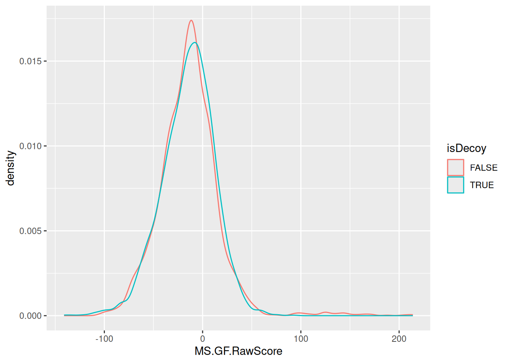
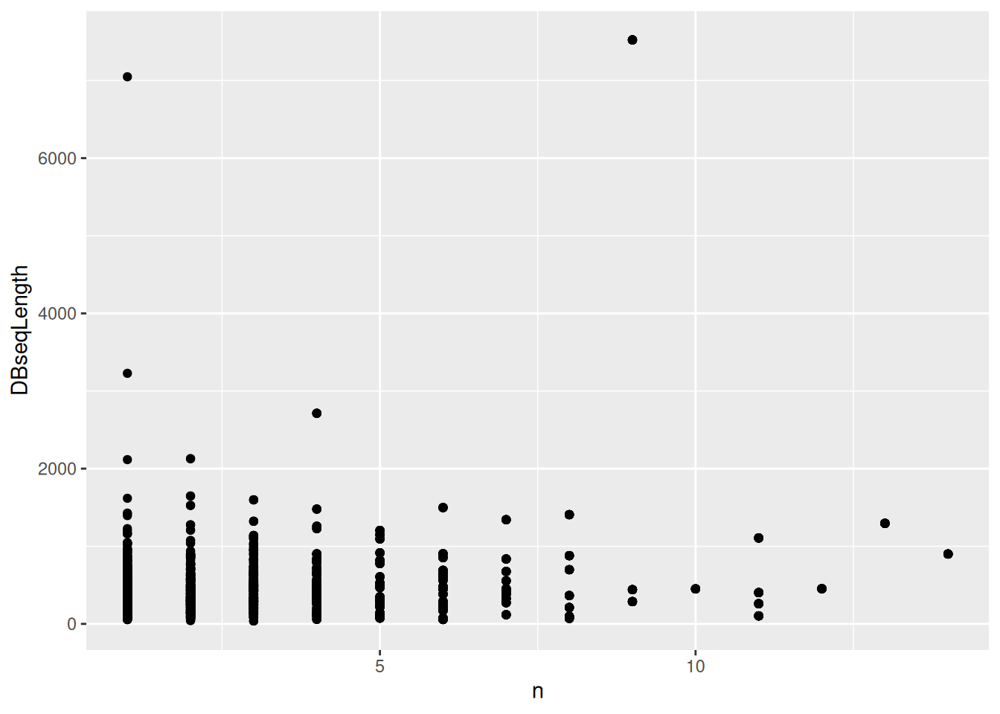
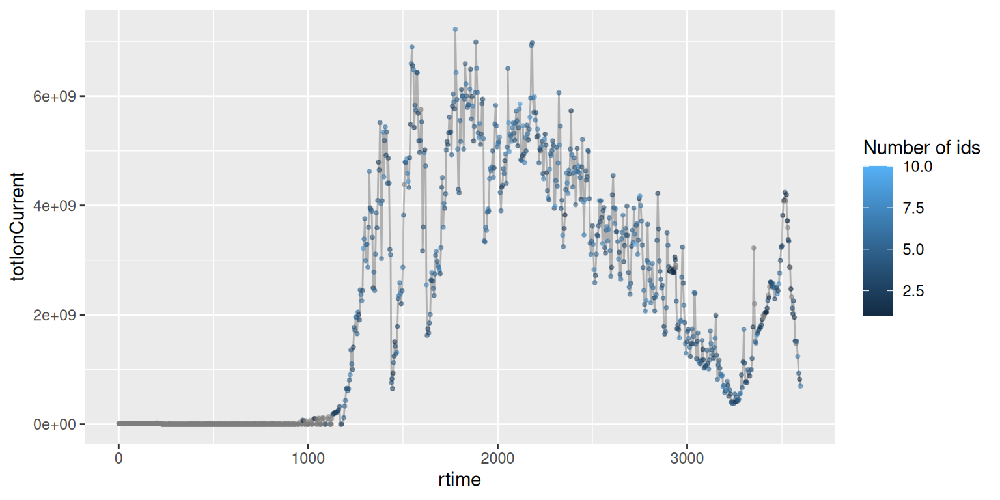
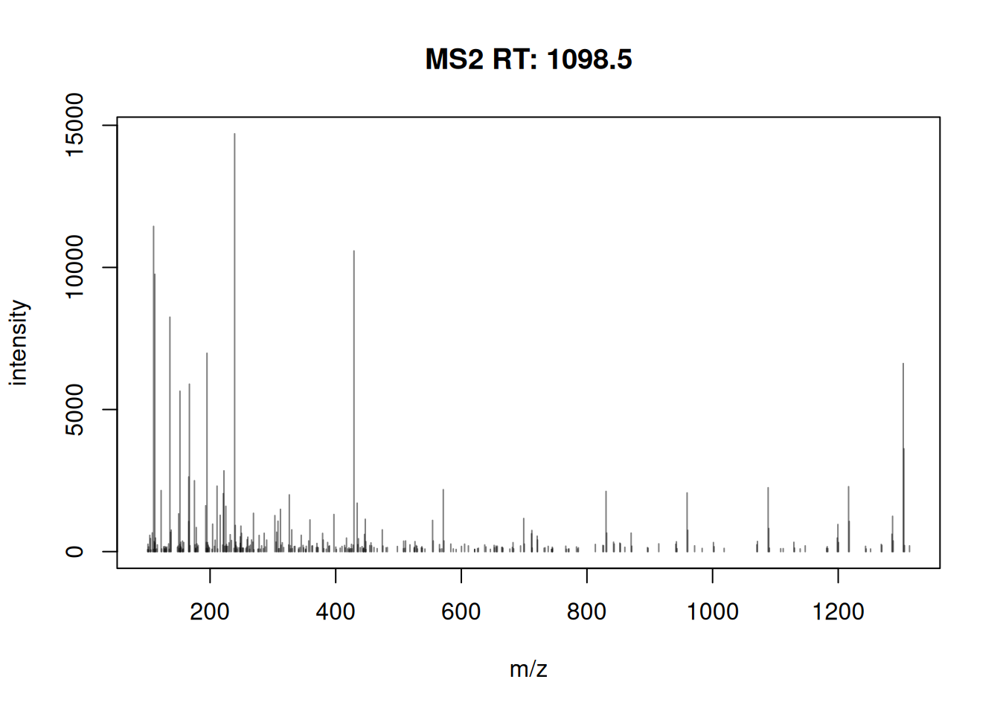
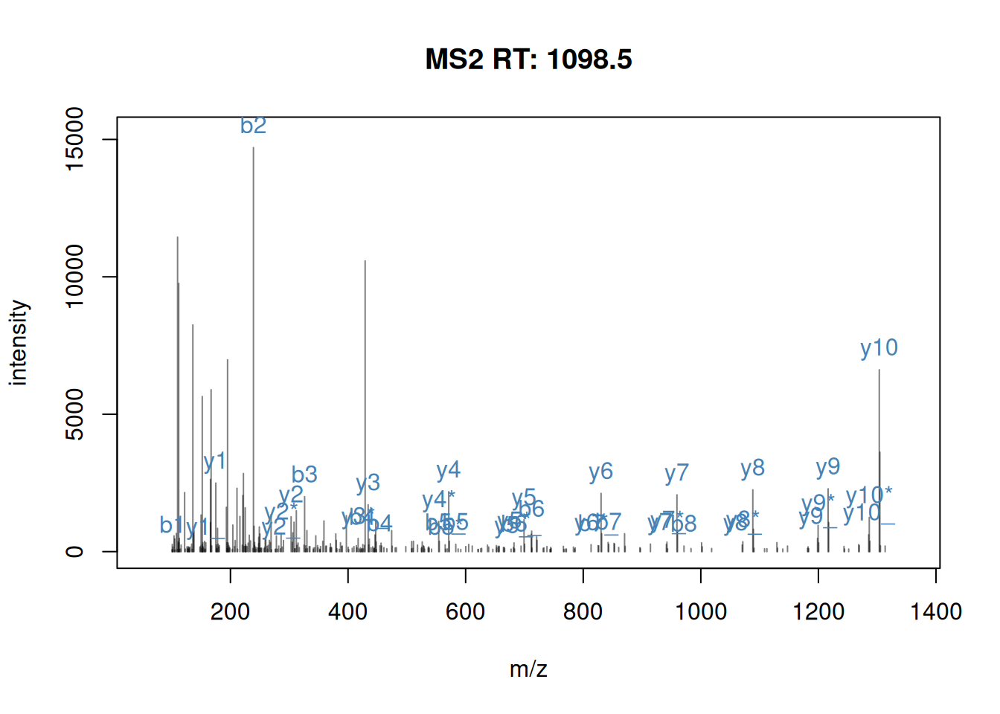
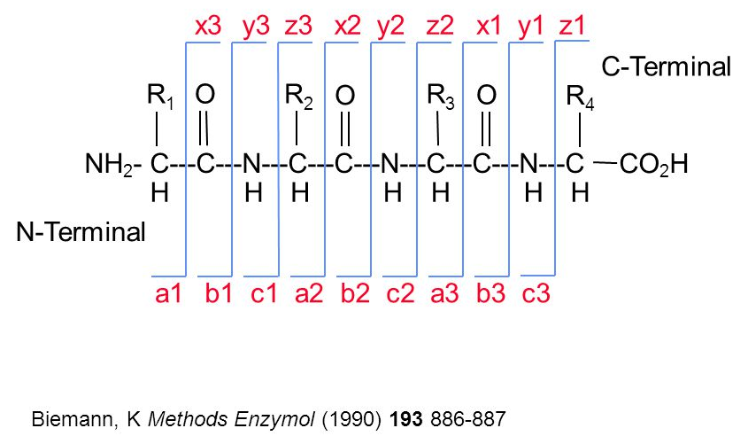
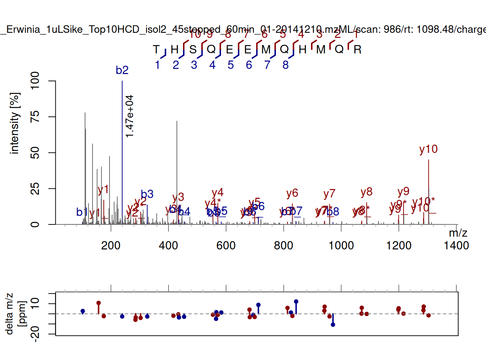
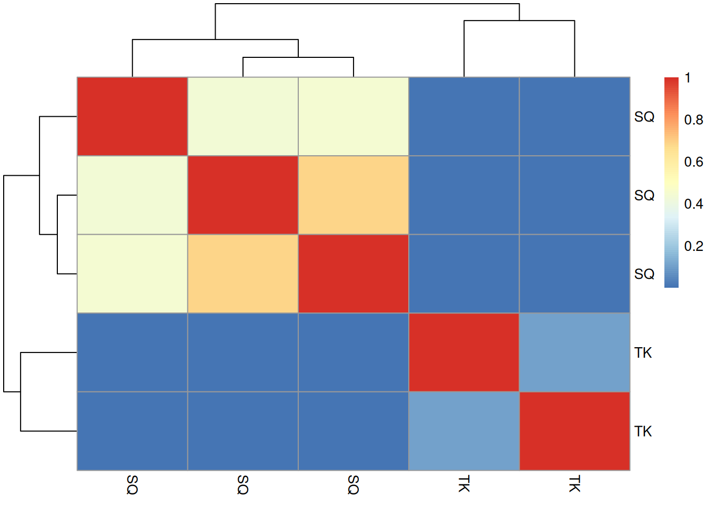
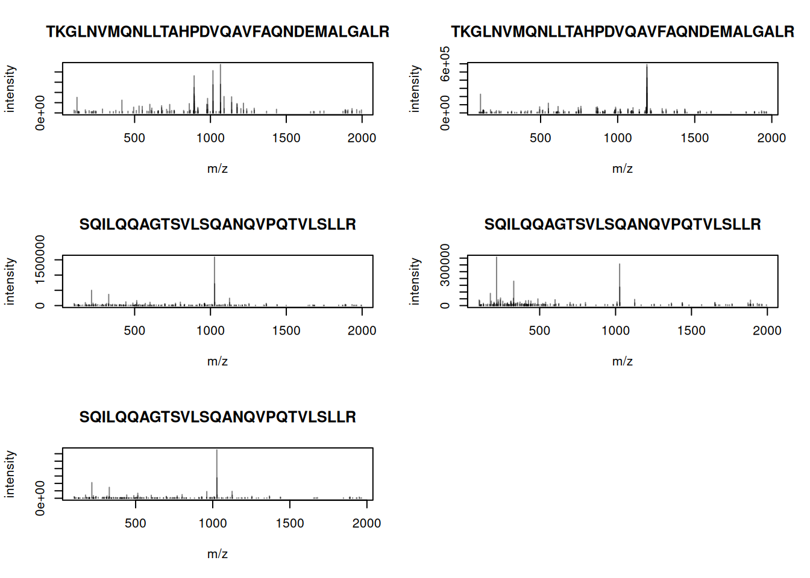

# 3  Identification data

Peptide identification is performed using third-party software - there is no package to run these searches directly in R. When using command line search engines it possible to hard-code or automatically generate the search command lines and run them from R using a [`system()`](https://rdrr.io/r/base/system.html) call. This allows to generate these reproducibly (especially useful if many command lines need to be run) and to keep a record in the R script of the exact command.

The example below illustrates this for 3 mzML files to be searched using `MSGFplus`:

``` downlit
(mzmls <- paste0("file_", 1:3, ".mzML"))
##  [1] "file_1.mzML" "file_2.mzML" "file_3.mzML"
(mzids <- sub("mzML", "mzid", mzmls))
##  [1] "file_1.mzid" "file_2.mzid" "file_3.mzid"

paste0("java -jar /path/to/MSGFPlus.jar",
       " -s ", mzmls,
       " -o ", mzids,
       " -d uniprot.fas",
       " -t 20ppm",
       " -m 0",
       " int 1")
##  [1] "java -jar /path/to/MSGFPlus.jar -s file_1.mzML -o file_1.mzid -d uniprot.fas -t 20ppm -m 0 int 1"
##  [2] "java -jar /path/to/MSGFPlus.jar -s file_2.mzML -o file_2.mzid -d uniprot.fas -t 20ppm -m 0 int 1"
##  [3] "java -jar /path/to/MSGFPlus.jar -s file_3.mzML -o file_3.mzid -d uniprot.fas -t 20ppm -m 0 int 1"
```

## 3.1 Identification data.frame

Let’s use the identification from `MsDataHub`:

``` downlit
idf <- MsDataHub::TMT_Erwinia_1uLSike_Top10HCD_isol2_45stepped_60min_01.20141210.mzid()
##  OpenTelemetry error: there is no package called 'otelsdk'
##  OpenTelemetry error: there is no package called 'otelsdk'
##  see ?MsDataHub and browseVignettes('MsDataHub') for documentation
##  loading from cache
idf
##                                          EH7807 
##  "/opt/R-cache/R/ExperimentHub/ff6de9f5cf_7857"
```

The easiest way to read identification data in `mzIdentML` (often abbreviated with `mzid`) into R is to read it with the [`PSM()`](https://rdrr.io/pkg/PSMatch/man/PSM.html) constructor function from the [`PSMatch`](https://rformassspectrometry.github.io/PSMatch/) package[^1]. The function will parse the file and return a `DataFrame`.

``` downlit
library(PSMatch)
id <- PSM(idf)
dim(id)
##  [1] 5802   35
names(id)
##   [1] "sequence"                 "spectrumID"              
##   [3] "chargeState"              "rank"                    
##   [5] "passThreshold"            "experimentalMassToCharge"
##   [7] "calculatedMassToCharge"   "peptideRef"              
##   [9] "modNum"                   "isDecoy"                 
##  [11] "post"                     "pre"                     
##  [13] "start"                    "end"                     
##  [15] "DatabaseAccess"           "DBseqLength"             
##  [17] "DatabaseSeq"              "DatabaseDescription"     
##  [19] "scan.number.s."           "acquisitionNum"          
##  [21] "spectrumFile"             "idFile"                  
##  [23] "MS.GF.RawScore"           "MS.GF.DeNovoScore"       
##  [25] "MS.GF.SpecEValue"         "MS.GF.EValue"            
##  [27] "MS.GF.QValue"             "MS.GF.PepQValue"         
##  [29] "modPeptideRef"            "modName"                 
##  [31] "modMass"                  "modLocation"             
##  [33] "subOriginalResidue"       "subReplacementResidue"   
##  [35] "subLocation"
```

> **NOTE:**
>
> Verify that this table contains 5802 matches for 5343 scans and 4938 peptides sequences.

> **NOTE:**
>
> ``` downlit
> nrow(id) ## number of matches
> ##  [1] 5802
> length(unique(id$spectrumID)) ## number of scans
> ##  [1] 5343
> length(unique(id$sequence))   ## number of peptide sequences
> ##  [1] 4938
> ```

The PSM data are read as is, without any filtering. As we can see below, we still have all the hits from the forward and reverse (decoy) databases.

``` downlit
table(id$isDecoy)
##  
##  FALSE  TRUE 
##   2906  2896
```

## 3.2 Keeping all matches

The data also contains multiple matches for several spectra. The table below shows the number of number of spectra that have 1, 2, … up to 5 matches.

``` downlit
table(table(id$spectrumID))
##  
##     1    2    3    4    5 
##  4936  369   26   10    2
```

Below, we can see how scan 1774 has 4 matches, all to sequence `RTRYQAEVR`, which itself matches to 4 different proteins:

``` downlit
i <- which(id$spectrumID == "controllerType=0 controllerNumber=1 scan=1774")
data.frame(id[i, ])[1:5]
##               sequence                                    spectrumID
##  EH7807.1381 RTRYQAEVR controllerType=0 controllerNumber=1 scan=1774
##  EH7807.1382 RTRYQAEVR controllerType=0 controllerNumber=1 scan=1774
##  EH7807.1383 RTRYQAEVR controllerType=0 controllerNumber=1 scan=1774
##  EH7807.2477 RTRYQAEVR controllerType=0 controllerNumber=1 scan=1774
##              chargeState rank passThreshold
##  EH7807.1381           2    1          TRUE
##  EH7807.1382           2    1          TRUE
##  EH7807.1383           2    1          TRUE
##  EH7807.2477           2    1          TRUE
```

If the goal is to keep all the matches, but arranged by scan/spectrum, one can *reduce* the `PSM` object by the `spectrumID` variable, so that each scan correponds to a single row that still stores all values[^2]:

``` downlit
id2 <- reducePSMs(id, id$spectrumID)
id2
##  Reduced PSM with 5343 rows and 35 columns.
##  names(35): sequence spectrumID ... subReplacementResidue subLocation
```

The resulting object contains a single entry for scan 1774 with information for the multiple matches stored as lists within the cells.

``` downlit
j <- which(id2$spectrumID == "controllerType=0 controllerNumber=1 scan=1774")
id2[j, ]
##  Reduced PSM with 1 rows and 35 columns.
##  names(35): sequence spectrumID ... subReplacementResidue subLocation
```

``` downlit
id2[j, "DatabaseAccess"]
##  CharacterList of length 1
##  [["controllerType=0 controllerNumber=1 scan=1774"]] ECA2104 ... ECA4142
```

The is the type of complete identification table that could be used to annotate an raw mass spectrometry `Spectra` object, as shown below.

## 3.3 Filtering data

Often, the PSM data is filtered to only retain reliable matches. The `MSnID` package can be used to set thresholds to attain user-defined PSM, peptide or protein-level FDRs. Here, we will simply filter out wrong identification manually.

Here, the [`filter()`](https://dplyr.tidyverse.org/reference/filter.html) from the `dplyr` package comes very handy. We will thus start by converting the `DataFrame` to a `tibble`.

``` downlit
library("dplyr")
id_tbl <- tidyr::as_tibble(id)
id_tbl
##  # A tibble: 5,802 × 35
##    sequence                  spectrumID        chargeState  rank passThreshold
##    <chr>                     <chr>                   <int> <int> <lgl>        
##  1 RQCRTDFLNYLR              controllerType=0…           3     1 TRUE         
##  2 ESVALADQVTCVDWRNRKATKK    controllerType=0…           2     1 TRUE         
##  3 KELLCLAMQIIR              controllerType=0…           2     1 TRUE         
##  4 QRMARTSDKQQSIRFLERLCGR    controllerType=0…           3     1 TRUE         
##  5 KDEGSTEPLKVVRDMTDAICMLLR  controllerType=0…           3     1 TRUE         
##  6 DGGPAIYGHERVGRNAKKFKCLKFR controllerType=0…           3     1 TRUE         
##  # ℹ 5,796 more rows
##  # ℹ 30 more variables: experimentalMassToCharge <dbl>, …
```

> **NOTE:**
>
> - Remove decoy hits

> **NOTE:**
>
> ``` downlit
> id_tbl <- id_tbl |>
>     filter(!isDecoy)
> id_tbl
> ##  # A tibble: 2,906 × 35
> ##    sequence                    spectrumID      chargeState  rank passThreshold
> ##    <chr>                       <chr>                 <int> <int> <lgl>        
> ##  1 RQCRTDFLNYLR                controllerType…           3     1 TRUE         
> ##  2 ESVALADQVTCVDWRNRKATKK      controllerType…           2     1 TRUE         
> ##  3 QRMARTSDKQQSIRFLERLCGR      controllerType…           3     1 TRUE         
> ##  4 DGGPAIYGHERVGRNAKKFKCLKFR   controllerType…           3     1 TRUE         
> ##  5 QRMARTSDKQQSIRFLERLCGR      controllerType…           2     1 TRUE         
> ##  6 CIDRARHVEVQIFGDGKGRVVALGER… controllerType…           3     1 TRUE         
> ##  # ℹ 2,900 more rows
> ##  # ℹ 30 more variables: experimentalMassToCharge <dbl>, …
> ```

> **NOTE:**
>
> - Keep first rank matches

> **NOTE:**
>
> ``` downlit
> id_tbl <- id_tbl |>
>     filter(rank == 1)
> id_tbl
> ##  # A tibble: 2,751 × 35
> ##    sequence                    spectrumID      chargeState  rank passThreshold
> ##    <chr>                       <chr>                 <int> <int> <lgl>        
> ##  1 RQCRTDFLNYLR                controllerType…           3     1 TRUE         
> ##  2 ESVALADQVTCVDWRNRKATKK      controllerType…           2     1 TRUE         
> ##  3 QRMARTSDKQQSIRFLERLCGR      controllerType…           3     1 TRUE         
> ##  4 DGGPAIYGHERVGRNAKKFKCLKFR   controllerType…           3     1 TRUE         
> ##  5 QRMARTSDKQQSIRFLERLCGR      controllerType…           2     1 TRUE         
> ##  6 CIDRARHVEVQIFGDGKGRVVALGER… controllerType…           3     1 TRUE         
> ##  # ℹ 2,745 more rows
> ##  # ℹ 30 more variables: experimentalMassToCharge <dbl>, …
> ```

> **NOTE:**
>
> - Remove shared peptides. Start by identifying scans that match different proteins. For example scan 4884 matches proteins `XXX_ECA3406` and `ECA3415`. Scan 4099 match `XXX_ECA4416_1`, `XXX_ECA4416_2` and `XXX_ECA4416_3`. Then remove the scans that match any of these proteins.

> **NOTE:**
>
> ``` downlit
> mltm <-
>     id_tbl |>
>     group_by(spectrumID) |>
>     mutate(nProts = length(unique(DatabaseAccess))) |>
>     filter(nProts > 1) |>
>     select(spectrumID, nProts)
> mltm
> ##  # A tibble: 85 × 2
> ##  # Groups:   spectrumID [39]
> ##    spectrumID                                    nProts
> ##    <chr>                                          <int>
> ##  1 controllerType=0 controllerNumber=1 scan=1073      2
> ##  2 controllerType=0 controllerNumber=1 scan=1073      2
> ##  3 controllerType=0 controllerNumber=1 scan=6578      2
> ##  4 controllerType=0 controllerNumber=1 scan=6578      2
> ##  5 controllerType=0 controllerNumber=1 scan=5617      2
> ##  6 controllerType=0 controllerNumber=1 scan=5617      2
> ##  # ℹ 79 more rows
> ```
>
> ``` downlit
> id_tbl <-
>     id_tbl |>
>     filter(!spectrumID %in% mltm$spectrumID)
> id_tbl
> ##  # A tibble: 2,666 × 35
> ##    sequence                    spectrumID      chargeState  rank passThreshold
> ##    <chr>                       <chr>                 <int> <int> <lgl>        
> ##  1 RQCRTDFLNYLR                controllerType…           3     1 TRUE         
> ##  2 ESVALADQVTCVDWRNRKATKK      controllerType…           2     1 TRUE         
> ##  3 QRMARTSDKQQSIRFLERLCGR      controllerType…           3     1 TRUE         
> ##  4 DGGPAIYGHERVGRNAKKFKCLKFR   controllerType…           3     1 TRUE         
> ##  5 QRMARTSDKQQSIRFLERLCGR      controllerType…           2     1 TRUE         
> ##  6 CIDRARHVEVQIFGDGKGRVVALGER… controllerType…           3     1 TRUE         
> ##  # ℹ 2,660 more rows
> ##  # ℹ 30 more variables: experimentalMassToCharge <dbl>, …
> ```

Which leaves us with 2666 PSMs.

This can also be achieved with the [`filterPSMs()`](https://rdrr.io/pkg/PSMatch/man/filterPSMs.html) function, or the individual [`filterPsmRank()`](https://rdrr.io/pkg/PSMatch/man/filterPSMs.html), `filterPsmDecoy` and [`filterPsmShared()`](https://rdrr.io/pkg/PSMatch/man/filterPSMs.html) functions:

``` downlit
id_filtered <- filterPSMs(id)
##  Starting with 5802 PSMs:
##  Removed 2896 decoy hits.
##  Removed 155 PSMs with rank > 1.
##  Removed 85 shared peptides.
##  2666 PSMs left.
```

The [`describePeptides()`](https://rdrr.io/pkg/PSMatch/man/describeProteins.html) and [`describeProteins()`](https://rdrr.io/pkg/PSMatch/man/describeProteins.html) functions from the `PSMatch` package provide useful summaries of preptides and proteins in a PSM search result.

- [`describePeptides()`](https://rdrr.io/pkg/PSMatch/man/describeProteins.html) gives the number of unique and shared peptides and for the latter, the size of their protein groups:

``` downlit
describePeptides(id) ## before filtering
##  4938 peptides composed of
##   unique peptides: 4870
##   shared peptides (among protein):
##    54(2) 8(3) 5(4) 1(5)
describePeptides(id_filtered) ## filtered
##  2324 peptides composed of
##   unique peptides: 2324
##   shared peptides (among protein):
##    ()
```

- [`describeProteins()`](https://rdrr.io/pkg/PSMatch/man/describeProteins.html) gives the number of proteins defined by only unique, only shared, or a mixture of unique/shared peptides:

``` downlit
describeProteins(id) ## before filtering
##  3148 proteins composed of
##   only unique peptides: 3051
##   only shared peptides: 74
##   unique and shared peptides: 23
describeProteins(id_filtered) ## filtered
##  1466 proteins composed of
##   only unique peptides: 1466
##   only shared peptides: 0
##   unique and shared peptides: 0
```

The [Understanding protein groups with adjacency matrices](https://rformassspectrometry.github.io/PSMatch/articles/AdjacencyMatrix.html) `PSMatch` vignette provides additional tools to explore how proteins were inferred from peptides.

> **NOTE:**
>
> Compare the distribution of raw identification scores of the decoy and non-decoy hits. Interpret the figure.

> **NOTE:**
>
> ``` downlit
> library(ggplot2)
> ggplot(id, aes(x = MS.GF.RawScore,
>                colour = isDecoy)) +
>     geom_density()
> ```
>
> 

> **NOTE:**
>
> The *[tidyverse](https://CRAN.R-project.org/package=tidyverse)* tools are fit for data wrangling with identification data. Using the above identification dataframe, calculate the length of each peptide (you can use `nchar` with the peptide sequence `sequence`) and the number of peptides for each protein (defined as `DatabaseDescription`). Plot the length of the proteins against their respective number of peptides.

> **NOTE:**
>
> ``` downlit
> suppressPackageStartupMessages(library("dplyr"))
> iddf <- as_tibble(id_filtered) |>
>     mutate(peplen = nchar(sequence))
> npeps <- iddf |>
>     group_by(DatabaseAccess) |>
>     tally()
> iddf <- full_join(iddf, npeps)
> ##  Joining with `by = join_by(DatabaseAccess)`
>
> library("ggplot2")
> ggplot(iddf, aes(x = n, y = DBseqLength)) + geom_point()
> ```
>
> 
>
> Identifcation data wrangling.

If you would like to learn more about how the mzid data are handled by `PSMatch` via the *[mzR](https://bioconductor.org/packages/3.24/mzR)* and *[mzID](https://bioconductor.org/packages/3.24/mzID)* packages, check out the [sec-id2](#sec-id2) section in the annex.

## 3.4 Adding identification data to raw data

We are goind to use the `sp` object created in the previous chapter and the `id_filtered` variable generated above.

``` downlit
## This will fetch the cached file
mzf <- rpx::pxget(rpx::PXDataset("PXD000001"), "TMT_Erwinia_1uLSike_Top10HCD_isol2_45stepped_60min_01-20141210.mzML")
##  Loading PXD000001 from cache.
##  Loading TMT_Erwinia_1uLSike_Top10HCD_isol2_45stepped_60min_01-20141210.mzML from cache.
sp <- Spectra(mzf)
sp
##  MSn data (Spectra) with 7534 spectra in a MsBackendMzR backend:
##         msLevel     rtime scanIndex
##       <integer> <numeric> <integer>
##  1            1    0.4584         1
##  2            1    0.9725         2
##  3            1    1.8524         3
##  4            1    2.7424         4
##  5            1    3.6124         5
##  ...        ...       ...       ...
##  7530         2   3600.47      7530
##  7531         2   3600.83      7531
##  7532         2   3601.18      7532
##  7533         2   3601.57      7533
##  7534         2   3601.98      7534
##   ... 34 more variables/columns.
##  
##  file(s):
##  853174f95_TMT_Erwinia_1uLSike_Top10HCD_isol2_45stepped_60min_01-20141210.mzML
```

Identification data (as a `DataFrame`) can be merged into raw data (as a `Spectra` object) by adding new spectra variables to the appropriate MS2 spectra. Scans and peptide-spectrum matches can be matched by their spectrum identifers.

> **NOTE:**
>
> Identify the spectum identifier columns in the `sp` the `id_filtered` variables.

> **NOTE:**
>
> In the raw data, it is encoded as `spectrumId`, while in the identification data, we have `spectrumID`.
>
> ``` downlit
> head(id_filtered$spectrumID)
> ##  [1] "controllerType=0 controllerNumber=1 scan=2949"
> ##  [2] "controllerType=0 controllerNumber=1 scan=6534"
> ##  [3] "controllerType=0 controllerNumber=1 scan=4782"
> ##  [4] "controllerType=0 controllerNumber=1 scan=6118"
> ##  [5] "controllerType=0 controllerNumber=1 scan=4757"
> ##  [6] "controllerType=0 controllerNumber=1 scan=6518"
> head(sp$spectrumId)
> ##  [1] "controllerType=0 controllerNumber=1 scan=1"
> ##  [2] "controllerType=0 controllerNumber=1 scan=2"
> ##  [3] "controllerType=0 controllerNumber=1 scan=3"
> ##  [4] "controllerType=0 controllerNumber=1 scan=4"
> ##  [5] "controllerType=0 controllerNumber=1 scan=5"
> ##  [6] "controllerType=0 controllerNumber=1 scan=6"
> ```

We still have several PTMs that are matched to a single spectrum identifier:

``` downlit
table(table(id_filtered$spectrumID))
##  
##     1    2    3    4 
##  2630   13    2    1
```

Let’s look at `"controllerType=0 controllerNumber=1 scan=5490"`, the has 4 matching PSMs in detail.

``` downlit
which(table(id_filtered$spectrumID) == 4)
##  controllerType=0 controllerNumber=1 scan=5490 
##                                           1903
id_4 <- id_filtered[id_filtered$spectrumID == "controllerType=0 controllerNumber=1 scan=5490", ] |>
    as.data.frame()
id_4
##                    sequence                                    spectrumID
##  EH7807.23 KCNQCLKVACTLFYCK controllerType=0 controllerNumber=1 scan=5490
##  EH7807.24 KCNQCLKVACTLFYCK controllerType=0 controllerNumber=1 scan=5490
##  EH7807.25 KCNQCLKVACTLFYCK controllerType=0 controllerNumber=1 scan=5490
##  EH7807.26 KCNQCLKVACTLFYCK controllerType=0 controllerNumber=1 scan=5490
##            chargeState rank passThreshold experimentalMassToCharge
##  EH7807.23           3    1          TRUE                 698.6633
##  EH7807.24           3    1          TRUE                 698.6633
##  EH7807.25           3    1          TRUE                 698.6633
##  EH7807.26           3    1          TRUE                 698.6633
##            calculatedMassToCharge peptideRef modNum isDecoy post pre start
##  EH7807.23               698.3315     Pep453      4   FALSE    C   K   127
##  EH7807.24               698.3315     Pep453      4   FALSE    C   K   127
##  EH7807.25               698.3315     Pep453      4   FALSE    C   K   127
##  EH7807.26               698.3315     Pep453      4   FALSE    C   K   127
##            end DatabaseAccess DBseqLength DatabaseSeq
##  EH7807.23 142        ECA0668         302            
##  EH7807.24 142        ECA0668         302            
##  EH7807.25 142        ECA0668         302            
##  EH7807.26 142        ECA0668         302            
##                     DatabaseDescription scan.number.s. acquisitionNum
##  EH7807.23 ECA0668 hypothetical protein           5490           5490
##  EH7807.24 ECA0668 hypothetical protein           5490           5490
##  EH7807.25 ECA0668 hypothetical protein           5490           5490
##  EH7807.26 ECA0668 hypothetical protein           5490           5490
##                                                                   spectrumFile
##  EH7807.23 TMT_Erwinia_1uLSike_Top10HCD_isol2_45stepped_60min_01-20141210.mzML
##  EH7807.24 TMT_Erwinia_1uLSike_Top10HCD_isol2_45stepped_60min_01-20141210.mzML
##  EH7807.25 TMT_Erwinia_1uLSike_Top10HCD_isol2_45stepped_60min_01-20141210.mzML
##  EH7807.26 TMT_Erwinia_1uLSike_Top10HCD_isol2_45stepped_60min_01-20141210.mzML
##                     idFile MS.GF.RawScore MS.GF.DeNovoScore MS.GF.SpecEValue
##  EH7807.23 ff6de9f5cf_7857            -22                79     4.555588e-07
##  EH7807.24 ff6de9f5cf_7857            -22                79     4.555588e-07
##  EH7807.25 ff6de9f5cf_7857            -22                79     4.555588e-07
##  EH7807.26 ff6de9f5cf_7857            -22                79     4.555588e-07
##            MS.GF.EValue MS.GF.QValue MS.GF.PepQValue modPeptideRef
##  EH7807.23     1.307689    0.9006211       0.8901099        Pep453
##  EH7807.24     1.307689    0.9006211       0.8901099        Pep453
##  EH7807.25     1.307689    0.9006211       0.8901099        Pep453
##  EH7807.26     1.307689    0.9006211       0.8901099        Pep453
##                    modName  modMass modLocation subOriginalResidue
##  EH7807.23 Carbamidomethyl 57.02146           2               <NA>
##  EH7807.24 Carbamidomethyl 57.02146           5               <NA>
##  EH7807.25 Carbamidomethyl 57.02146          10               <NA>
##  EH7807.26 Carbamidomethyl 57.02146          15               <NA>
##            subReplacementResidue subLocation
##  EH7807.23                  <NA>          NA
##  EH7807.24                  <NA>          NA
##  EH7807.25                  <NA>          NA
##  EH7807.26                  <NA>          NA
```

We can see that these 4 PSMs differ by the location of the Carbamidomethyl modification.

``` downlit
id_4[, c("modName", "modLocation")]
##                    modName modLocation
##  EH7807.23 Carbamidomethyl           2
##  EH7807.24 Carbamidomethyl           5
##  EH7807.25 Carbamidomethyl          10
##  EH7807.26 Carbamidomethyl          15
```

Let’s reduce that PSM table before joining it to the `Spectra` object, to make sure we have unique one-to-one matches between the raw spectra and the PSMs.

``` downlit
id_filtered <- reducePSMs(id_filtered, id_filtered$spectrumID)
id_filtered
##  Reduced PSM with 2646 rows and 35 columns.
##  names(35): sequence spectrumID ... subReplacementResidue subLocation
```

These two data can thus simply be joined using:

``` downlit
sp <- joinSpectraData(sp, id_filtered,
                      by.x = "spectrumId",
                      by.y = "spectrumID")
spectraVariables(sp)
##   [1] "msLevel"                  "rtime"                   
##   [3] "acquisitionNum"           "scanIndex"               
##   [5] "dataStorage"              "dataOrigin"              
##   [7] "centroided"               "smoothed"                
##   [9] "polarity"                 "precScanNum"             
##  [11] "precursorMz"              "precursorIntensity"      
##  [13] "precursorCharge"          "collisionEnergy"         
##  [15] "isolationWindowLowerMz"   "isolationWindowTargetMz" 
##  [17] "isolationWindowUpperMz"   "peaksCount"              
##  [19] "totIonCurrent"            "basePeakMZ"              
##  [21] "basePeakIntensity"        "electronBeamEnergy"      
##  [23] "ionisationEnergy"         "lowMZ"                   
##  [25] "highMZ"                   "mergedScan"              
##  [27] "mergedResultScanNum"      "mergedResultStartScanNum"
##  [29] "mergedResultEndScanNum"   "injectionTime"           
##  [31] "filterString"             "spectrumId"              
##  [33] "ionMobilityDriftTime"     "scanWindowLowerLimit"    
##  [35] "scanWindowUpperLimit"     "sequence"                
##  [37] "chargeState"              "rank"                    
##  [39] "passThreshold"            "experimentalMassToCharge"
##  [41] "calculatedMassToCharge"   "peptideRef"              
##  [43] "modNum"                   "isDecoy"                 
##  [45] "post"                     "pre"                     
##  [47] "start"                    "end"                     
##  [49] "DatabaseAccess"           "DBseqLength"             
##  [51] "DatabaseSeq"              "DatabaseDescription"     
##  [53] "scan.number.s."           "acquisitionNum.y"        
##  [55] "spectrumFile"             "idFile"                  
##  [57] "MS.GF.RawScore"           "MS.GF.DeNovoScore"       
##  [59] "MS.GF.SpecEValue"         "MS.GF.EValue"            
##  [61] "MS.GF.QValue"             "MS.GF.PepQValue"         
##  [63] "modPeptideRef"            "modName"                 
##  [65] "modMass"                  "modLocation"             
##  [67] "subOriginalResidue"       "subReplacementResidue"   
##  [69] "subLocation"
```

> **NOTE:**
>
> Verify that the identification data has been added to the correct spectra.

> **NOTE:**
>
> Let’s first verify that no identification data has been added to the MS1 scans.
>
> ``` downlit
> all(is.na(filterMsLevel(sp, 1)$sequence))
> ##  [1] TRUE
> ```
>
> They have indeed been added to 2646 of the 6103 MS2 spectra.
>
> ``` downlit
> sp_2 <- filterMsLevel(sp, 2)
> table(is.na(sp_2$sequence))
> ##  
> ##  FALSE  TRUE 
> ##   2646  3457
> ```
>
> Let’s compare the precursor (experimental) and peptide (calculated) mass to charges
>
> ``` downlit
> sp_2 <- sp_2[!is.na(sp_2$sequence)]
> summary(sp_2$calculatedMassToCharge - sp_2$experimentalMassToCharge)
> ##       Min.   1st Qu.    Median      Mean   3rd Qu.      Max. 
> ##  -0.522095 -0.494202 -0.018585 -0.214069 -0.002808  0.022705
> ```

## 3.5 An identification-annotated chromatogram

Now that we have combined raw data and their associated peptide-spectrum matches, we can produce an improved total ion chromatogram, identifying MS1 scans that lead to successful identifications.

The `countIdentifications()` function is going to tally the number of identifications (i.e non-missing characters in the `sequence` spectra variable) for each scan. In the case of MS2 scans, these will be either 1 or 0, depending on the presence of a sequence. For MS1 scans, the function will count the number of sequences for the descendant MS2 scans, i.e. those produced from precursor ions from each MS1 scan.

``` downlit
sp <- countIdentifications(sp)
```

Below, we see on the second line that 3457 MS2 scans lead to no PSM, while 2546 lead to an identification. Among all MS1 scans, 833 lead to no MS2 scans with PSMs. 30 MS1 scans generated one MS2 scan that lead to a PSM, 45 lead to two PSMs, …

``` downlit
table(msLevel(sp), sp$countIdentifications)
##     
##         0    1    2    3    4    5    6    7    8    9   10
##    1  833   30   45   97  139  132   92   42   17    3    1
##    2 3457 2646    0    0    0    0    0    0    0    0    0
```

These data can also be visualised on the total ion chromatogram:

``` downlit
sp |>
    filterMsLevel(1) |>
    spectraData() |>
    as_tibble() |>
    ggplot(aes(x = rtime,
               y = totIonCurrent)) +
    geom_line(alpha = 0.25) +
    geom_point(aes(colour = ifelse(countIdentifications == 0,
                                   NA, countIdentifications)),
               size = 0.75,
               alpha = 0.5) +
    labs(colour = "Number of ids")
```



## 3.6 Visualising peptide-spectrum matches

Let’s choose a MS2 spectrum with a high identification score and plot it.

``` downlit
i <- which(sp$MS.GF.RawScore > 100)[1]
plotSpectra(sp[i])
```



We have seen above that we can add labels to each peak using the `labels` argument in `plotSpectra()`. The [`labelFragments()`](https://rdrr.io/pkg/PSMatch/man/labelFragments.html) function takes a spectrum as input (that is a `Spectra` object of length 1) and annotates its peaks.

``` downlit
labelFragments(sp[i])
##  $THSQEEMQHMQR
##    [1] NA     NA     NA     "b1"   NA     NA     NA     NA     NA     NA    
##   [11] NA     NA     NA     NA     NA     NA     NA     NA     NA     NA    
##   [21] NA     NA     NA     NA     NA     NA     NA     NA     NA     NA    
##   [31] NA     NA     NA     NA     NA     NA     NA     NA     NA     NA    
##   [41] NA     NA     NA     "y1_"  NA     NA     NA     NA     NA     "y1"  
##   [51] NA     NA     NA     NA     NA     NA     NA     NA     NA     NA    
##   [61] NA     NA     NA     NA     NA     NA     NA     NA     NA     NA    
##   [71] NA     NA     NA     NA     NA     NA     NA     NA     NA     NA    
##   [81] NA     NA     NA     NA     NA     NA     "b2"   NA     NA     NA    
##   [91] NA     NA     NA     NA     NA     NA     NA     NA     NA     NA    
##  [101] NA     NA     NA     NA     NA     NA     NA     NA     NA     NA    
##  [111] NA     NA     NA     NA     NA     NA     NA     "y2_"  "y2*"  NA    
##  [121] NA     "y2"   NA     NA     NA     NA     NA     NA     NA     NA    
##  [131] NA     NA     "b3"   NA     NA     NA     NA     NA     NA     NA    
##  [141] NA     NA     NA     NA     NA     NA     NA     NA     NA     NA    
##  [151] NA     NA     NA     NA     NA     NA     NA     NA     NA     NA    
##  [161] NA     NA     NA     NA     NA     NA     NA     NA     NA     NA    
##  [171] "y3*"  NA     NA     NA     NA     NA     NA     NA     NA     NA    
##  [181] "y3"   NA     "b4_"  NA     NA     NA     NA     NA     NA     NA    
##  [191] NA     NA     "b4"   NA     NA     NA     NA     NA     NA     NA    
##  [201] NA     NA     NA     NA     NA     NA     NA     NA     NA     NA    
##  [211] NA     NA     NA     NA     NA     NA     NA     "y4*"  NA     "b5_" 
##  [221] "b5*"  NA     "y4"   NA     "b5"   NA     NA     NA     NA     NA    
##  [231] NA     NA     NA     NA     NA     NA     NA     NA     NA     NA    
##  [241] NA     NA     NA     NA     NA     NA     "y5_"  "y5*"  NA     "b6_" 
##  [251] "y5"   NA     NA     "b6"   NA     NA     NA     NA     NA     NA    
##  [261] NA     NA     NA     NA     NA     NA     NA     NA     NA     NA    
##  [271] NA     "y6*"  "b7_"  NA     "y6"   NA     NA     "b7"   NA     NA    
##  [281] NA     NA     NA     NA     NA     NA     "y7_"  "y7*"  NA     "y7"  
##  [291] NA     "b8"   NA     NA     NA     NA     "y8_"  "y8*"  "y8"   NA    
##  [301] NA     NA     NA     NA     NA     NA     NA     NA     NA     NA    
##  [311] "y9_"  "y9*"  NA     "y9"   NA     NA     NA     NA     NA     NA    
##  [321] "y10_" "y10*" NA     "y10"  NA     NA     NA    
##  
##  attr(,"group")
##  [1] 1
```

It can be directly used with `plotSpectra()`:

``` downlit
plotSpectra(sp[i], labels = labelFragments,
            labelPos = 3, labelCol = "steelblue")
```



When a precursor peptide ion is fragmented in a CID cell, it breaks at specific bonds, producing sets of peaks (*a*, *b*, *c* and *x*, *y*, *z*) that can be predicted.



Peptide fragmentation.

The annotation of spectra is obtained by simulating fragmentation of a peptide and matching observed peaks to fragments:

``` downlit
sp[i]$sequence
##  [1] "THSQEEMQHMQR"
calculateFragments(sp[i]$sequence)
##  Fixed modifications used: C=57.02146
##  Variable modifications used: None
##            mz  ion type pos z         seq      peptide
##  1   102.0550   b1    b   1 1           T THSQEEMQHMQR
##  2   239.1139   b2    b   2 1          TH THSQEEMQHMQR
##  3   326.1459   b3    b   3 1         THS THSQEEMQHMQR
##  4   454.2045   b4    b   4 1        THSQ THSQEEMQHMQR
##  5   583.2471   b5    b   5 1       THSQE THSQEEMQHMQR
##  6   712.2897   b6    b   6 1      THSQEE THSQEEMQHMQR
##  7   843.3301   b7    b   7 1     THSQEEM THSQEEMQHMQR
##  8   971.3887   b8    b   8 1    THSQEEMQ THSQEEMQHMQR
##  9  1108.4476   b9    b   9 1   THSQEEMQH THSQEEMQHMQR
##  10 1239.4881  b10    b  10 1  THSQEEMQHM THSQEEMQHMQR
##  11 1367.5467  b11    b  11 1 THSQEEMQHMQ THSQEEMQHMQR
##  12  175.1190   y1    y   1 1           R THSQEEMQHMQR
##  13  303.1775   y2    y   2 1          QR THSQEEMQHMQR
##  14  434.2180   y3    y   3 1         MQR THSQEEMQHMQR
##  15  571.2769   y4    y   4 1        HMQR THSQEEMQHMQR
##  16  699.3355   y5    y   5 1       QHMQR THSQEEMQHMQR
##  17  830.3760   y6    y   6 1      MQHMQR THSQEEMQHMQR
##  18  959.4186   y7    y   7 1     EMQHMQR THSQEEMQHMQR
##  19 1088.4612   y8    y   8 1    EEMQHMQR THSQEEMQHMQR
##  20 1216.5198   y9    y   9 1   QEEMQHMQR THSQEEMQHMQR
##  21 1303.5518  y10    y  10 1  SQEEMQHMQR THSQEEMQHMQR
##  22 1440.6107  y11    y  11 1 HSQEEMQHMQR THSQEEMQHMQR
##  23  436.1939  b4_   b_   4 1        THSQ THSQEEMQHMQR
##  24  565.2365  b5_   b_   5 1       THSQE THSQEEMQHMQR
##  25  694.2791  b6_   b_   6 1      THSQEE THSQEEMQHMQR
##  26  825.3196  b7_   b_   7 1     THSQEEM THSQEEMQHMQR
##  27  953.3782  b8_   b_   8 1    THSQEEMQ THSQEEMQHMQR
##  28 1090.4371  b9_   b_   9 1   THSQEEMQH THSQEEMQHMQR
##  29 1221.4776 b10_   b_  10 1  THSQEEMQHM THSQEEMQHMQR
##  30 1349.5361 b11_   b_  11 1 THSQEEMQHMQ THSQEEMQHMQR
##  31  941.4080  y7_   y_   7 1     EMQHMQR THSQEEMQHMQR
##  32 1070.4506  y8_   y_   8 1    EEMQHMQR THSQEEMQHMQR
##  33 1422.6001 y11_   y_  11 1 HSQEEMQHMQR THSQEEMQHMQR
##  34  157.1084  y1_   y_   1 1           R THSQEEMQHMQR
##  35  285.1670  y2_   y_   2 1          QR THSQEEMQHMQR
##  36  416.2075  y3_   y_   3 1         MQR THSQEEMQHMQR
##  37  553.2664  y4_   y_   4 1        HMQR THSQEEMQHMQR
##  38  681.3249  y5_   y_   5 1       QHMQR THSQEEMQHMQR
##  39  812.3654  y6_   y_   6 1      MQHMQR THSQEEMQHMQR
##  40 1198.5092  y9_   y_   9 1   QEEMQHMQR THSQEEMQHMQR
##  41 1285.5412 y10_   y_  10 1  SQEEMQHMQR THSQEEMQHMQR
##  42  566.2205  b5*   b*   5 1       THSQE THSQEEMQHMQR
##  43  695.2631  b6*   b*   6 1      THSQEE THSQEEMQHMQR
##  44  826.3036  b7*   b*   7 1     THSQEEM THSQEEMQHMQR
##  45  954.3622  b8*   b*   8 1    THSQEEMQ THSQEEMQHMQR
##  46 1091.4211  b9*   b*   9 1   THSQEEMQH THSQEEMQHMQR
##  47 1222.4616 b10*   b*  10 1  THSQEEMQHM THSQEEMQHMQR
##  48 1350.5202 b11*   b*  11 1 THSQEEMQHMQ THSQEEMQHMQR
##  49  286.1510  y2*   y*   2 1          QR THSQEEMQHMQR
##  50  417.1915  y3*   y*   3 1         MQR THSQEEMQHMQR
##  51  554.2504  y4*   y*   4 1        HMQR THSQEEMQHMQR
##  52  682.3090  y5*   y*   5 1       QHMQR THSQEEMQHMQR
##  53  813.3495  y6*   y*   6 1      MQHMQR THSQEEMQHMQR
##  54  942.3920  y7*   y*   7 1     EMQHMQR THSQEEMQHMQR
##  55 1071.4346  y8*   y*   8 1    EEMQHMQR THSQEEMQHMQR
##  56 1199.4932  y9*   y*   9 1   QEEMQHMQR THSQEEMQHMQR
##  57 1286.5252 y10*   y*  10 1  SQEEMQHMQR THSQEEMQHMQR
##  58 1423.5842 y11*   y*  11 1 HSQEEMQHMQR THSQEEMQHMQR
```

Note that the [`plotSpectraPTM()`](https://rdrr.io/pkg/PSMatch/man/plotSpectraPTM.html) from the [`PSMatch` package](https://rformassspectrometry.github.io/PSMatch/) offers improved visualisation:

1.  The function nadds the annotated peptides sequence on the plot with the respective b and y ions and the deviation between observed and calculated fragment masses.

``` downlit
plotSpectraPTM(sp[i])
```



2.  It can also display, as its name implies, multi-panel plots for peptides with [variable modifications](https://rformassspectrometry.github.io/PSMatch/reference/plotSpectraPTM.html).

## 3.7 Comparing spectra

The `compareSpectra()` function can be used to compare spectra (by default, computing the normalised dot product).

> **NOTE:**
>
> 1.  Create a new `Spectra` object containing the MS2 spectra with sequences `"SQILQQAGTSVLSQANQVPQTVLSLLR"` and `"TKGLNVMQNLLTAHPDVQAVFAQNDEMALGALR"`.

> **NOTE:**
>
> ``` downlit
> k <- which(sp$sequence %in% c("SQILQQAGTSVLSQANQVPQTVLSLLR", "TKGLNVMQNLLTAHPDVQAVFAQNDEMALGALR"))
> sp_k <- sp[k]
> sp_k
> ##  MSn data (Spectra) with 5 spectra in a MsBackendMzR backend:
> ##      msLevel     rtime scanIndex
> ##    <integer> <numeric> <integer>
> ##  1         2   2687.42      5230
> ##  2         2   2688.88      5235
> ##  3         2   2748.75      5397
> ##  4         2   2765.26      5442
> ##  5         2   2768.17      5449
> ##   ... 69 more variables/columns.
> ##  
> ##  file(s):
> ##  853174f95_TMT_Erwinia_1uLSike_Top10HCD_isol2_45stepped_60min_01-20141210.mzML
> ```

> **NOTE:**
>
> 2.  Calculate the 5 by 5 similarity matrix between all spectra using `compareSpectra`. See the `?Spectra` man page for details. Draw a heatmap of that matrix.

> **NOTE:**
>
> ``` downlit
> mat <- compareSpectra(sp_k)
> rownames(mat) <- colnames(mat) <- strtrim(sp_k$sequence, 2)
> mat
> ##               TK          TK           SQ          SQ           SQ
> ##  TK 1.0000000000 0.109126094 0.0009373465 0.001261338 0.0008256185
> ##  TK 0.1091260942 1.000000000 0.0025314670 0.001459654 0.0017613212
> ##  SQ 0.0009373465 0.002531467 1.0000000000 0.432133016 0.6879331218
> ##  SQ 0.0012613380 0.001459654 0.4321330158 1.000000000 0.4467153012
> ##  SQ 0.0008256185 0.001761321 0.6879331218 0.446715301 1.0000000000
> pheatmap::pheatmap(mat)
> ```
>
> 

> **NOTE:**
>
> 3.  Compare the spectra with the plotting function seen previously.

> **NOTE:**
>
> ``` downlit
> filterIntensity(sp_k, 1e3) |>
>     plotSpectra(main = sp_k$sequence)
> ```
>
> 
>
> ``` downlit
> par(mfrow = c(3, 1))
> plotSpectraMirror(sp_k[1], sp_k[2], main = "TK...")
> plotSpectraMirror(sp_k[3], sp_k[4], main = "SQ...")
> plotSpectraMirror(sp_k[3], sp_k[4], main = "SQ...")
> ```
>
> 

## 3.8 Reading and processing protein sequences

It can sometimes be necessary to do some protein sequence processing in R, for compute peptides for a set of proteins of interest. Let’s start by downloading the fasta sequence file from the PXD000001 experiment.

``` downlit
library(rpx)
px <- PXDataset("PXD000001")
##  Loading PXD000001 from cache.
(fas <- pxget(px, grep("fasta", pxfiles(px))))
##  Project PXD000001 files (12):
##   [remote] F063721.dat
##   [remote] F063721.dat-mztab.txt
##   [remote] PRIDE_Exp_Complete_Ac_22134.xml.gz
##   [remote] PRIDE_Exp_mzData_Ac_22134.xml.gz
##   [remote] PXD000001_community_annotated.sdrf.tsv
##   [remote] PXD000001_mztab.txt
##   [remote] README.txt
##   [local]  TMT_Erwinia_1uLSike_Top10HCD_isol2_45stepped_60min_01-20141210.mzML
##   [remote] TMT_Erwinia_1uLSike_Top10HCD_isol2_45stepped_60min_01-20141210.mzXML
##   [remote] TMT_Erwinia_1uLSike_Top10HCD_isol2_45stepped_60min_01.mzXML
##   ...
##  Loading erwinia_carotovora.fasta from cache.
##  [1] "/opt/R-cache/R/rpx/86858dc9c_erwinia_carotovora.fasta"
```

The fasta file can be read into R as a dedicated `AAStringSet` from the *[Biostrings](https://bioconductor.org/packages/3.24/Biostrings)* package, that can be used to very efficiently manage DNA, RNA and protein sequence.

``` downlit
library(Biostrings)
(prots <- readAAStringSet(fas))
##  AAStringSet object of length 4499:
##         width sequence                                    names               
##     [1]   147 MADITLISGSTLGSAEYVAE...HQIPEDPAEEWLGSWVNLLK ECA0001 putative ...
##     [2]   153 VAEIYQIDNLDRGILSALME...IQSTETLISLQNPIMRTIAP ECA0002 AsnC-fami...
##     [3]   330 MKKQYIEKQQQISFVKSFFS...GQVQCGVWPQPLRESVSGLL ECA0003 putative ...
##     [4]   492 MITLESLEMLLSIDENELLD...RFDTGLKSRLMRRWQHGKAY ECA0004 conserved...
##     [5]   499 MRQTAALAERISRLSHALEH...KIEASLQQVAEQIQQSEQQD ECA0005 conserved...
##     ...   ... ...
##  [4495]   634 MSDKIIHLTDDSFDTDVLKA...RKVDPLRVFASDMARRLELL trx-rv3790 trx-rv...
##  [4496]    93 MTKMNNKARRTARELKHLGA...ELRDEFPMGYLGDYKDDDDK TimBlower TimBlower
##  [4497]   309 MFSNLSKRWAQRTLSKSFYS...FKWAGIKTRKFVFNPPKPRK sp|P07143|CY1_YEA...
##  [4498]   231 FPTDDDDKIVGGYTCAANSI...GVYTKVCNYVNWIQQTIAAN sp|P00761|TRYP_PI...
##  [4499]   269 GVSGSCNIDVVCPEGNGHRD...AAGTGAQFIDGLDSTGTPPV sp|Q7M135|LYSC_LY...
```

Finally, the *[cleaver](https://bioconductor.org/packages/3.24/cleaver)* package can be used to cleave protein sequences using any of the many proteases. Below, we’ll use trypsin without any miscleavages.

``` downlit
library(cleaver)
(peps <- cleave(prots, enzym = "trypsin", missedCleavages = 0))
##  AAStringSetList of length 4499
##  [["ECA0001 putative flavoprotein (initiation of chromosome replication)"]] ...
##  [["ECA0002 AsnC-family transcriptional regulator"]] VAEIYQIDNLDR ... TIAP
##  [["ECA0003 putative asparagine synthetase A"]] MK K ... ESVSGLL
##  [["ECA0004 conserved hypothetical protein"]] MITLESLEMLLSIDENELLDDLVVTLMAT...
##  [["ECA0005 conserved hypothetical protein"]] MR ... IEASLQQVAEQIQQSEQQD
##  [["ECA0006 potassium uptake protein"]] MSSEHK R ... AADQFEIPPNR LIELGIQVEI
##  [["ECA0007 two-component system sensor kinase"]] MNR ... VTFTNQPEGGLIVSVNW
##  [["ECA0008 two-component system response regulator."]] MR ... TVHGVGYILGDAP
##  [["ECA0009 putative exported protein"]] MK K ... QIR L
##  [["ECA0010 high affinity ribose transport protein"]] MK ...
##  ...
##  <4489 more elements>
```

The resulting `AAStringSetList` contains the one `AAStringSet` containing peptides sequences for each of the 4499 proteins.

``` downlit
peps[[1]]
##  AAStringSet object of length 7:
##      width sequence
##  [1]    28 MADITLISGSTLGSAEYVAEHLAELLEK
##  [2]    39 DNFSTEILHGPTLDALPESGIWLVVTSTHGAGEFPDNLK
##  [3]    26 ALFEQLEQQKPDLSQVNFGAIGIGSK
##  [4]    14 EYDTFCGAIQTADR
##  [5]     8 LLAQLGAK
##  [6]     1 R
##  [7]    31 IGEILEIDITQHQIPEDPAEEWLGSWVNLLK
```

It is also possible to repeat the above step to generate a decoy database by reversing the protein `AAStringSet` object:

``` downlit
(rev <- reverse(prots))
##  AAStringSet object of length 4499:
##         width sequence                                    names               
##     [1]   147 KLLNVWSGLWEEAPDEPIQH...EAVYEASGLTSGSILTIDAM ECA0001 putative ...
##     [2]   153 PAITRMIPNQLSILTETSQI...EMLASLIGRDLNDIQYIEAV ECA0002 AsnC-fami...
##     [3]   330 LLGSVSERLPQPWVGCQVQG...SFFSKVFSIQQQKEIYQKKM ECA0003 putative ...
##     [4]   492 YAKGHQWRRMLRSKLGTDFR...DLLENEDISLLMELSELTIM ECA0004 conserved...
##     [5]   499 DQQESQQIQEAVQQLSAEIK...HELAHSLRSIREALAATQRM ECA0005 conserved...
##     ...   ... ...
##  [4495]   634 LLELRRAMDSAFVRLPDVKR...AKLVDTDFSDDTLHIIKDSM trx-rv3790 trx-rv...
##  [4496]    93 KDDDDKYDGLYGMPFEDRLE...AGLHKLERATRRAKNNMKTM TimBlower TimBlower
##  [4497]   309 KRPKPPNFVFKRTKIGAWKF...SYFSKSLTRQAWRKSLNSFM sp|P07143|CY1_YEA...
##  [4498]   231 NAAITQQIWNVYNCVKTYVG...ISNAACTYGGVIKDDDDTPF sp|P00761|TRYP_PI...
##  [4499]   269 VPPTGTSDLGDIFQAGTGAA...DRHGNGEPCVVDINCSGSVG sp|Q7M135|LYSC_LY...
```

``` downlit
prots[[1]]
##  147-letter AAString object:
##  MADITLISGSTLGSAEYVAEHLAELLEKDNFSTEILH...QLGAKRIGEILEIDITQHQIPEDPAEEWLGSWVNLLK
rev[[1]]
##  147-letter AAString object:
##  KLLNVWSGLWEEAPDEPIQHQTIDIELIEGIRKAGLQ...HLIETSFNDKELLEALHEAVYEASGLTSGSILTIDAM
```

## 3.9 Exploration and Assessment of Identifications using `MSnID`

The `MSnID` package extracts MS/MS ID data from mzIdentML (leveraging the `mzID` package) or text files. After collating the search results from multiple datasets it assesses their identification quality and optimises filtering criteria to achieve the maximum number of identifications while not exceeding a specified false discovery rate. It also contains a number of utilities to explore the MS/MS results and assess missed and irregular enzymatic cleavages, mass measurement accuracy, etc.

### 3.9.1 Step-by-step work-flow

Let’s reproduce parts of the analysis described the `MSnID` vignette. You can explore more with

``` downlit
vignette("msnid_vignette", package = "MSnID")
```

The *[MSnID](https://bioconductor.org/packages/3.24/MSnID)* package can be used for post-search filtering of MS/MS identifications. One starts with the construction of an `MSnID` object that is populated with identification results that can be imported from a `data.frame` or from `mzIdenML` files. Here, we will use the example identification data provided with the package.

``` downlit
mzids <- system.file("extdata", "c_elegans.mzid.gz", package="MSnID")
basename(mzids)
##  [1] "c_elegans.mzid.gz"
```

We start by loading the package, initialising the `MSnID` object, and add the identification result from our `mzid` file (there could of course be more than one).

``` downlit
library("MSnID")
msnid <- MSnID(".")
##  Note, the anticipated/suggested columns in the
##  peptide-to-spectrum matching results are:
##  -----------------------------------------------
##  accession
##  calculatedMassToCharge
##  chargeState
##  experimentalMassToCharge
##  isDecoy
##  peptide
##  spectrumFile
##  spectrumID
msnid <- read_mzIDs(msnid, mzids)
##  Reading from mzIdentMLs ...
##  reading c_elegans.mzid.gz...
##   DONE!
show(msnid)
##  MSnID object
##  Working directory: "."
##  #Spectrum Files:  1 
##  #PSMs: 12263 at 36 % FDR
##  #peptides: 9489 at 44 % FDR
##  #accessions: 7414 at 76 % FDR
```

Printing the `MSnID` object returns some basic information such as

- Working directory.
- Number of spectrum files used to generate data.
- Number of peptide-to-spectrum matches and corresponding FDR.
- Number of unique peptide sequences and corresponding FDR.
- Number of unique proteins or amino acid sequence accessions and corresponding FDR.

The package then enables to define, optimise and apply filtering based for example on missed cleavages, identification scores, precursor mass errors, etc. and assess PSM, peptide and protein FDR levels. To properly function, it expects to have access to the following data

    ##  [1] "accession"                "calculatedMassToCharge"  
    ##  [3] "chargeState"              "experimentalMassToCharge"
    ##  [5] "isDecoy"                  "peptide"                 
    ##  [7] "spectrumFile"             "spectrumID"

which are indeed present in our data:

``` downlit
names(msnid)
##   [1] "spectrumID"                "scan number(s)"           
##   [3] "acquisitionNum"            "passThreshold"            
##   [5] "rank"                      "calculatedMassToCharge"   
##   [7] "experimentalMassToCharge"  "chargeState"              
##   [9] "MS-GF:DeNovoScore"         "MS-GF:EValue"             
##  [11] "MS-GF:PepQValue"           "MS-GF:QValue"             
##  [13] "MS-GF:RawScore"            "MS-GF:SpecEValue"         
##  [15] "AssumedDissociationMethod" "IsotopeError"             
##  [17] "isDecoy"                   "post"                     
##  [19] "pre"                       "end"                      
##  [21] "start"                     "accession"                
##  [23] "length"                    "description"              
##  [25] "pepSeq"                    "modified"                 
##  [27] "modification"              "idFile"                   
##  [29] "spectrumFile"              "databaseFile"             
##  [31] "peptide"
```

Here, we summarise a few steps and redirect the reader to the package’s vignette for more details:

### 3.9.2 Analysis of peptide sequences

Cleaning irregular cleavages at the termini of the peptides and missing cleavage site within the peptide sequences. The following two function calls create the new `numMisCleavages` and `numIrregCleavages` columns in the `MSnID` object

``` downlit
msnid <- assess_termini(msnid, validCleavagePattern="[KR]\\.[^P]")
msnid <- assess_missed_cleavages(msnid, missedCleavagePattern="[KR](?=[^P$])")
```

### 3.9.3 Trimming the data

Now, we can use the `apply_filter` function to effectively apply filters. The strings passed to the function represent expressions that will be evaluated, thus keeping only PSMs that have 0 irregular cleavages and 2 or less missed cleavages.

``` downlit
msnid <- apply_filter(msnid, "numIrregCleavages == 0")
msnid <- apply_filter(msnid, "numMissCleavages <= 2")
show(msnid)
##  MSnID object
##  Working directory: "."
##  #Spectrum Files:  1 
##  #PSMs: 7838 at 17 % FDR
##  #peptides: 5598 at 23 % FDR
##  #accessions: 3759 at 53 % FDR
```

### 3.9.4 Parent ion mass errors

Using `"calculatedMassToCharge"` and `"experimentalMassToCharge"`, the `mass_measurement_error` function calculates the parent ion mass measurement error in parts per million.

``` downlit
summary(mass_measurement_error(msnid))
##        Min.    1st Qu.     Median       Mean    3rd Qu.       Max. 
##  -2184.0640    -0.6992     0.0000    17.6146     0.7511  2012.5178
```

We then filter any matches that do not fit the +/- 20 ppm tolerance

``` downlit
msnid <- apply_filter(msnid, "abs(mass_measurement_error(msnid)) < 20")
summary(mass_measurement_error(msnid))
##      Min.  1st Qu.   Median     Mean  3rd Qu.     Max. 
##  -19.7797  -0.5866   0.0000  -0.2970   0.5713  19.6758
```

### 3.9.5 Filtering criteria

Filtering of the identification data will rely on

- -log10 transformed MS-GF+ Spectrum E-value, reflecting the goodness of match between experimental and theoretical fragmentation patterns

``` downlit
msnid$msmsScore <- -log10(msnid$`MS-GF:SpecEValue`)
```

- the absolute mass measurement error (in ppm units) of the parent ion

``` downlit
msnid$absParentMassErrorPPM <- abs(mass_measurement_error(msnid))
```

### 3.9.6 Setting filters

MS2 filters are handled by a special `MSnIDFilter` class objects, where individual filters are set by name (that is present in `names(msnid)`) and comparison operator (\>, \<, = , …) defining if we should retain hits with higher or lower given the threshold and finally the threshold value itself.

``` downlit
filtObj <- MSnIDFilter(msnid)
filtObj$absParentMassErrorPPM <- list(comparison="<", threshold=10.0)
filtObj$msmsScore <- list(comparison=">", threshold=10.0)
show(filtObj)
##  MSnIDFilter object
##  (absParentMassErrorPPM < 10) & (msmsScore > 10)
```

We can then evaluate the filter on the identification data object, which returns the false discovery rate and number of retained identifications for the filtering criteria at hand.

``` downlit
evaluate_filter(msnid, filtObj)
##            fdr    n
##  PSM         0 3807
##  peptide     0 2455
##  accession   0 1009
```

### 3.9.7 Filter optimisation

Rather than setting filtering values by hand, as shown above, these can be set automatically to meet a specific false discovery rate.

``` downlit
filtObj.grid <- optimize_filter(filtObj, msnid, fdr.max=0.01,
                                method="Grid", level="peptide",
                                n.iter=500)
show(filtObj.grid)
##  MSnIDFilter object
##  (absParentMassErrorPPM < 3) & (msmsScore > 7.4)
```

``` downlit
evaluate_filter(msnid, filtObj.grid)
##                    fdr    n
##  PSM       0.004097561 5146
##  peptide   0.006447651 3278
##  accession 0.021996616 1208
```

Filters can eventually be applied (rather than just evaluated) using the `apply_filter` function.

``` downlit
msnid <- apply_filter(msnid, filtObj.grid)
show(msnid)
##  MSnID object
##  Working directory: "."
##  #Spectrum Files:  1 
##  #PSMs: 5146 at 0.41 % FDR
##  #peptides: 3278 at 0.64 % FDR
##  #accessions: 1208 at 2.2 % FDR
```

And finally, identifications that matched decoy and contaminant protein sequences are removed

``` downlit
msnid <- apply_filter(msnid, "isDecoy == FALSE")
msnid <- apply_filter(msnid, "!grepl('Contaminant',accession)")
show(msnid)
##  MSnID object
##  Working directory: "."
##  #Spectrum Files:  1 
##  #PSMs: 5117 at 0 % FDR
##  #peptides: 3251 at 0 % FDR
##  #accessions: 1179 at 0 % FDR
```

### 3.9.8 Export `MSnID` data

The resulting filtered identification data can be exported to a `data.frame` (or to a dedicated `MSnSet` data structure from the `MSnbase` package) for quantitative MS data, described below, and further processed and analysed using appropriate statistical tests.

``` downlit
head(psms(msnid))
##    spectrumID scan number(s) acquisitionNum passThreshold rank
##  1 index=7151           8819           7151          TRUE    1
##  2 index=8520          10419           8520          TRUE    1
##  3 index=6683           8279           6683          TRUE    1
##  4 index=6683           8279           6683          TRUE    1
##  5 index=6683           8279           6683          TRUE    1
##  6 index=6683           8279           6683          TRUE    1
##    calculatedMassToCharge experimentalMassToCharge chargeState
##  1               1270.318                 1270.318           3
##  2               1426.737                 1426.739           3
##  3               1440.348                 1440.350           3
##  4               1440.348                 1440.350           3
##  5               1440.348                 1440.350           3
##  6               1440.348                 1440.350           3
##    MS-GF:DeNovoScore MS-GF:EValue MS-GF:PepQValue MS-GF:QValue MS-GF:RawScore
##  1               287 1.709082e-24               0            0            239
##  2               270 3.780745e-24               0            0            230
##  3               294 1.106378e-23               0            0            224
##  4               294 1.106378e-23               0            0            224
##  5               294 1.106378e-23               0            0            224
##  6               294 1.106378e-23               0            0            224
##    MS-GF:SpecEValue AssumedDissociationMethod IsotopeError isDecoy post pre
##  1     1.007452e-31                       CID            0   FALSE    A   K
##  2     2.217275e-31                       CID            0   FALSE    A   K
##  3     6.504763e-31                       CID            0   FALSE    W   K
##  4     6.504763e-31                       CID            0   FALSE    W   K
##  5     6.504763e-31                       CID            0   FALSE    W   K
##  6     6.504763e-31                       CID            0   FALSE    W   K
##    end start accession length
##  1 283   249   CE02347    393
##  2 182   142   CE07055    206
##  3 422   385   CE12728    654
##  4 422   385   CE36358    582
##  5 355   318   CE36359    587
##  6 386   349   CE36360    618
##                                                                                                                            description
##  1 WBGene00001993; locus:hpd-1; 4-hydroxyphenylpyruvate dioxygenase; status:Confirmed; UniProt:Q22633; protein_id:CAA90315.1; T21C12.2
##  2           WBGene00001755; locus:gst-7; glutathione S-transferase; status:Confirmed; UniProt:P91253; protein_id:AAB37846.1; F11G11.2
##  3                WBGene00011232; phosphoenolpyruvate carboxykinase; status:Confirmed; UniProt:O02286; protein_id:CAB05600.1; R11A5.4a
##  4                                         WBGene00011232; status:Partially_confirmed; UniProt:Q7JKI1; protein_id:CAF31484.1; R11A5.4b
##  5                                                   WBGene00011232; status:Confirmed; UniProt:Q7JKI3; protein_id:CAF31482.1; R11A5.4c
##  6                                                   WBGene00011232; status:Confirmed; UniProt:Q7JKI2; protein_id:CAF31483.1; R11A5.4d
##                                       pepSeq modified modification
##  1       AISQIQEYVDYYGGSGVQHIALNTSDIITAIEALR    FALSE         <NA>
##  2 SAGSGYLVGDSLTFVDLLVAQHTADLLAANAALLDEFPQFK    FALSE         <NA>
##  3    NSIFTNVAETANGEYFWEGLEDEIADKNVDITTWLGEK    FALSE         <NA>
##  4    NSIFTNVAETANGEYFWEGLEDEIADKNVDITTWLGEK    FALSE         <NA>
##  5    NSIFTNVAETANGEYFWEGLEDEIADKNVDITTWLGEK    FALSE         <NA>
##  6    NSIFTNVAETANGEYFWEGLEDEIADKNVDITTWLGEK    FALSE         <NA>
##               idFile                                   spectrumFile
##  1 c_elegans.mzid.gz c_elegans_A_3_1_21Apr10_Draco_10-03-04_dta.txt
##  2 c_elegans.mzid.gz c_elegans_A_3_1_21Apr10_Draco_10-03-04_dta.txt
##  3 c_elegans.mzid.gz c_elegans_A_3_1_21Apr10_Draco_10-03-04_dta.txt
##  4 c_elegans.mzid.gz c_elegans_A_3_1_21Apr10_Draco_10-03-04_dta.txt
##  5 c_elegans.mzid.gz c_elegans_A_3_1_21Apr10_Draco_10-03-04_dta.txt
##  6 c_elegans.mzid.gz c_elegans_A_3_1_21Apr10_Draco_10-03-04_dta.txt
##                databaseFile                                       peptide
##  1 ID_004174_E48C5B52.fasta       K.AISQIQEYVDYYGGSGVQHIALNTSDIITAIEALR.A
##  2 ID_004174_E48C5B52.fasta K.SAGSGYLVGDSLTFVDLLVAQHTADLLAANAALLDEFPQFK.A
##  3 ID_004174_E48C5B52.fasta    K.NSIFTNVAETANGEYFWEGLEDEIADKNVDITTWLGEK.W
##  4 ID_004174_E48C5B52.fasta    K.NSIFTNVAETANGEYFWEGLEDEIADKNVDITTWLGEK.W
##  5 ID_004174_E48C5B52.fasta    K.NSIFTNVAETANGEYFWEGLEDEIADKNVDITTWLGEK.W
##  6 ID_004174_E48C5B52.fasta    K.NSIFTNVAETANGEYFWEGLEDEIADKNVDITTWLGEK.W
##    numIrregCleavages numMissCleavages msmsScore absParentMassErrorPPM
##  1                 0                0  30.99678             0.3843772
##  2                 0                0  30.65418             1.3689451
##  3                 0                1  30.18677             0.9322561
##  4                 0                1  30.18677             0.9322561
##  5                 0                1  30.18677             0.9322561
##  6                 0                1  30.18677             0.9322561
```

[^1]: Previously named `PSM`.

[^2]: The rownames aren’t needed here are are removed to reduce to output in the the next code chunk display parts of `id2`.
