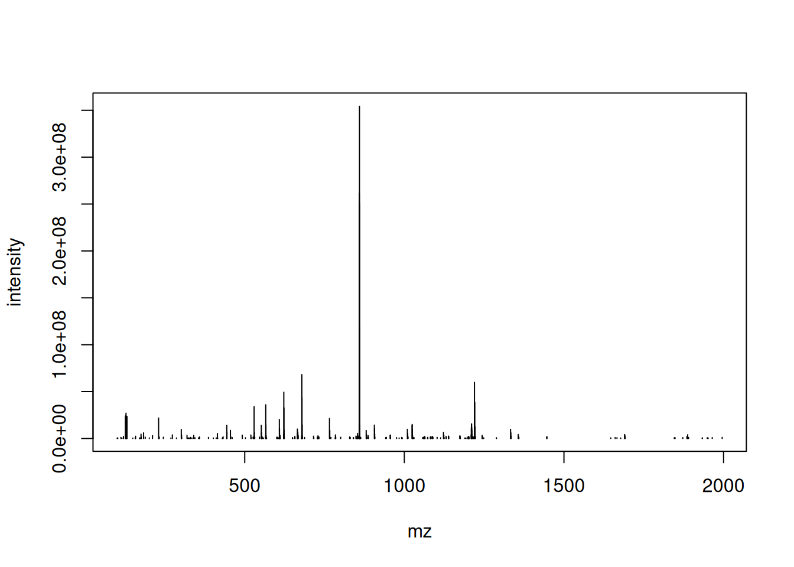
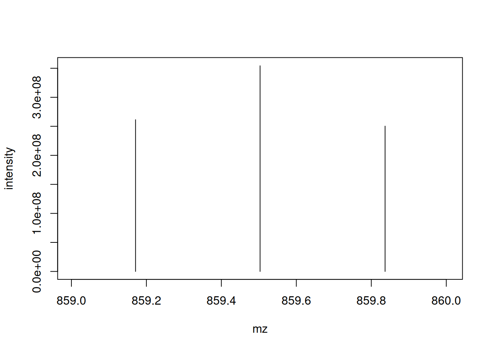
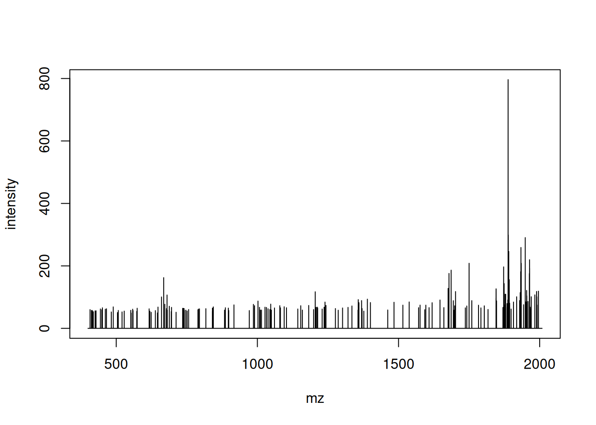
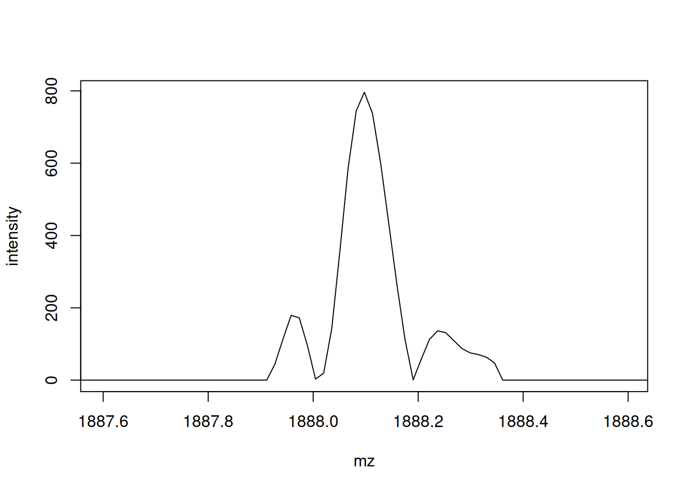

# 6  Annex

## 6.1 Raw MS data under the hood: the `mzR` package

The `mzR` package is a direct interface to the [proteowizard](http://proteowizard.sourceforge.net/) code base. It includes a substantial proportion of *pwiz*’s C/C++ code for fast and efficient parsing of these large raw data files.

Let’s start by getting some raw data from the `MsDataHub` package.

``` downlit
f <- MsDataHub::TMT_Erwinia_1uLSike_Top10HCD_isol2_45stepped_60min_01.20141210.mzML.gz()
##  OpenTelemetry error: there is no package called 'otelsdk'
##  OpenTelemetry error: there is no package called 'otelsdk'
##  see ?MsDataHub and browseVignettes('MsDataHub') for documentation
##  loading from cache
```

The three main functions of `mzR` are

- `openMSfile` to create a file handle to a raw data file
- `header` to extract metadata about the spectra contained in the file
- `peaks` to extract one or multiple spectra of interest.

Other functions such as `instrumentInfo`, or `runInfo` can be used to gather general information about a run.

``` downlit
library("mzR")
ms <- openMSfile(f)
ms
##  Mass Spectrometry file handle.
##  Filename:  ff313a5c2_7858 
##  Number of scans:  7534
```

``` downlit
hd <- header(ms)
dim(hd)
##  [1] 7534   32
names(hd)
##   [1] "seqNum"                     "acquisitionNum"            
##   [3] "msLevel"                    "polarity"                  
##   [5] "peaksCount"                 "totIonCurrent"             
##   [7] "retentionTime"              "basePeakMZ"                
##   [9] "basePeakIntensity"          "collisionEnergy"           
##  [11] "electronBeamEnergy"         "ionisationEnergy"          
##  [13] "lowMZ"                      "highMZ"                    
##  [15] "precursorScanNum"           "precursorMZ"               
##  [17] "precursorCharge"            "precursorIntensity"        
##  [19] "mergedScan"                 "mergedResultScanNum"       
##  [21] "mergedResultStartScanNum"   "mergedResultEndScanNum"    
##  [23] "injectionTime"              "filterString"              
##  [25] "spectrumId"                 "centroided"                
##  [27] "ionMobilityDriftTime"       "isolationWindowTargetMZ"   
##  [29] "isolationWindowLowerOffset" "isolationWindowUpperOffset"
##  [31] "scanWindowLowerLimit"       "scanWindowUpperLimit"
```

``` downlit
head(peaks(ms, 117))
##             mz intensity
##  [1,] 399.9976         0
##  [2,] 399.9991         0
##  [3,] 400.0006         0
##  [4,] 400.0021         0
##  [5,] 400.2955         0
##  [6,] 400.2970         0
str(peaks(ms, 1:5))
##  List of 5
##   $ : num [1:25800, 1:2] 400 400 400 400 400 ...
##    ..- attr(*, "dimnames")=List of 2
##    .. ..$ : NULL
##    .. ..$ : chr [1:2] "mz" "intensity"
##   $ : num [1:25934, 1:2] 400 400 400 400 400 ...
##    ..- attr(*, "dimnames")=List of 2
##    .. ..$ : NULL
##    .. ..$ : chr [1:2] "mz" "intensity"
##   $ : num [1:26148, 1:2] 400 400 400 400 400 ...
##    ..- attr(*, "dimnames")=List of 2
##    .. ..$ : NULL
##    .. ..$ : chr [1:2] "mz" "intensity"
##   $ : num [1:26330, 1:2] 400 400 400 400 400 ...
##    ..- attr(*, "dimnames")=List of 2
##    .. ..$ : NULL
##    .. ..$ : chr [1:2] "mz" "intensity"
##   $ : num [1:26463, 1:2] 400 400 400 400 400 ...
##    ..- attr(*, "dimnames")=List of 2
##    .. ..$ : NULL
##    .. ..$ : chr [1:2] "mz" "intensity"
```

> **NOTE:**
>
> Let’s extract the index of the MS2 spectrum with the highest base peak intensity and plot its spectrum. Is the data centroided or in profile mode?

> **NOTE:**
>
> ``` downlit
> hd2 <- hd[hd$msLevel == 2, ]
> i <- which.max(hd2$basePeakIntensity)
> hd2[i, ]
> ##       seqNum acquisitionNum msLevel polarity peaksCount totIonCurrent
> ##  5404   5404           5404       2        1        275    2283283712
> ##       retentionTime basePeakMZ basePeakIntensity collisionEnergy
> ##  5404      2751.313   859.5032         354288224              45
> ##       electronBeamEnergy ionisationEnergy    lowMZ  highMZ precursorScanNum
> ##  5404                 NA                0 100.5031 1995.63             5403
> ##       precursorMZ precursorCharge precursorIntensity mergedScan
> ##  5404    859.1722               3          627820480         NA
> ##       mergedResultScanNum mergedResultStartScanNum mergedResultEndScanNum
> ##  5404                  NA                       NA                     NA
> ##       injectionTime                                             filterString
> ##  5404    0.03474091 FTMS + p NSI d Full ms2 859.50@hcd45.00 [100.00-2000.00]
> ##                                          spectrumId centroided
> ##  5404 controllerType=0 controllerNumber=1 scan=5404       TRUE
> ##       ionMobilityDriftTime isolationWindowTargetMZ isolationWindowLowerOffset
> ##  5404                   NA                   859.5                          1
> ##       isolationWindowUpperOffset scanWindowLowerLimit scanWindowUpperLimit
> ##  5404                          1                  100                 2000
> pi <- peaks(ms, hd2[i, 1])
> plot(pi, type = "h")
> ```
>
> 
>
> ``` downlit
> mz <- hd2[i, "basePeakMZ"]
> plot(pi, type = "h", xlim = c(mz - 0.5, mz + 0.5))
> ```
>
> 

> **NOTE:**
>
> Pick an MS1 spectrum and visually check whether it is centroided or in profile mode.

> **NOTE:**
>
> ``` downlit
> ## Zooming into spectrum 300 (an MS1 spectrum).
> j <- 300
> pj <- peaks(ms, j)
> plot(pj, type = "l")
> ```
>
> 
>
> ``` downlit
> mz <- hd[j, "basePeakMZ"]
> plot(pj, type = "l", xlim = c(mz - 0.5, mz + 0.5))
> ```
>
> 

## 6.2 PSM data under the hood

There are two packages that can be used to parse `mzIdentML` files, namely `mzR` (that we have already used for raw data) and `mzID`. The major difference is that the former leverages C++ code from `proteowizard` and is hence faster than the latter (which uses the `XML` R package). They both work in similar ways.

    |Data type      |File format |Data structure |Package |
    |:--------------|:-----------|:--------------|:-------|
    |Identification |mzIdentML   |mzRident       |mzR     |
    |Identification |mzIdentML   |mzID           |mzID    |

Which of these packages is used by `PSM()` can be defined by the `parser` argument, as documented in `?PSM`.

### `mzID`

The main functions are `mzID` to read the data into a dedicated data class and `flatten` to transform it into a `data.frame`.

``` downlit
## idf was created in the chapter on identification data
idf <- MsDataHub::TMT_Erwinia_1uLSike_Top10HCD_isol2_45stepped_60min_01.20141210.mzid()
##  see ?MsDataHub and browseVignettes('MsDataHub') for documentation
##  loading from cache
idf
##                                          EH7807 
##  "/opt/R-cache/R/ExperimentHub/ff6de9f5cf_7857"
# ---
library("mzID")
id <- mzID(idf)
##  reading ff6de9f5cf_7857...
##   DONE!
id
##  An mzID object
##  
##  Software used:   MS-GF+ (version: Beta (v10072))
##  
##  Rawfile:         /home/lg390/dev/01_svn/workflows/proteomics/TMT_Erwinia_1uLSike_Top10HCD_isol2_45stepped_60min_01-20141210.mzML
##  
##  Database:        /home/lg390/dev/01_svn/workflows/proteomics/erwinia_carotovora.fasta
##  
##  Number of scans: 5343
##  Number of PSM's: 5656
```

Various data can be extracted from the `mzID` object, using one of the accessor functions such as `database`, `software`, `scans`, `peptides`, … The object can also be converted into a `data.frame` using the `flatten` function.

``` downlit
head(flatten(id))
##                                       spectrumid scan number(s)
##  1 controllerType=0 controllerNumber=1 scan=5782           5782
##  2 controllerType=0 controllerNumber=1 scan=6037           6037
##  3 controllerType=0 controllerNumber=1 scan=5235           5235
##  4 controllerType=0 controllerNumber=1 scan=5397           5397
##  5 controllerType=0 controllerNumber=1 scan=6075           6075
##  6 controllerType=0 controllerNumber=1 scan=5761           5761
##    acquisitionnum passthreshold rank calculatedmasstocharge
##  1           5782          TRUE    1              1080.2321
##  2           6037          TRUE    1              1002.2115
##  3           5235          TRUE    1              1189.2800
##  4           5397          TRUE    1               960.5365
##  5           6075          TRUE    1              1264.3419
##  6           5761          TRUE    1              1268.6501
##    experimentalmasstocharge chargestate ms-gf:denovoscore ms-gf:evalue
##  1                1080.2325           3               174 1.086033e-20
##  2                1002.2089           3               245 1.988774e-19
##  3                1189.2836           3               264 5.129649e-19
##  4                 960.5365           3               178 5.163566e-18
##  5                1264.3409           3               252 4.356914e-17
##  6                1268.6429           2               138 4.658952e-17
##    ms-gf:pepqvalue ms-gf:qvalue ms-gf:rawscore ms-gf:specevalue
##  1               0            0            147     3.764831e-27
##  2               0            0            214     6.902626e-26
##  3               0            0            211     1.778789e-25
##  4               0            0            154     1.792541e-24
##  5               0            0            188     1.510364e-23
##  6               0            0            123     1.618941e-23
##    assumeddissociationmethod isotopeerror isdecoy post pre end start
##  1                       HCD            0   FALSE    S   R  84    50
##  2                       HCD            0   FALSE    R   K 315   288
##  3                       HCD            0   FALSE    A   R 224   192
##  4                       HCD            0   FALSE    -   R 290   264
##  5                       HCD            0   FALSE    F   R 153   119
##  6                       HCD            0   FALSE    Y   K 286   264
##    accession length                                       description
##  1   ECA1932    155                        outer membrane lipoprotein
##  2   ECA1147    434                                    trigger factor
##  3   ECA0013    295                ribose-binding periplasmic protein
##  4   ECA1731    290                                         flagellin
##  5   ECA1443    298      UTP--glucose-1-phosphate uridylyltransferase
##  6   ECA1444    468 6-phosphogluconate dehydrogenase, decarboxylating
##                                 pepseq modified modification          idFile
##  1 PVQIQAGEDSNVIGALGGAVLGGFLGNTIGGGSGR    FALSE         <NA> ff6de9f5cf_7857
##  2        TQVLDGLINANDIEVPVALIDGEIDVLR    FALSE         <NA> ff6de9f5cf_7857
##  3   TKGLNVMQNLLTAHPDVQAVFAQNDEMALGALR    FALSE         <NA> ff6de9f5cf_7857
##  4         SQILQQAGTSVLSQANQVPQTVLSLLR    FALSE         <NA> ff6de9f5cf_7857
##  5 PIIGDNPFVVVLPDVVLDESTADQTQENLALLISR    FALSE         <NA> ff6de9f5cf_7857
##  6             WTSQSSLDLGEPLSLITESVFAR    FALSE         <NA> ff6de9f5cf_7857
##                                                           spectrumFile
##  1 TMT_Erwinia_1uLSike_Top10HCD_isol2_45stepped_60min_01-20141210.mzML
##  2 TMT_Erwinia_1uLSike_Top10HCD_isol2_45stepped_60min_01-20141210.mzML
##  3 TMT_Erwinia_1uLSike_Top10HCD_isol2_45stepped_60min_01-20141210.mzML
##  4 TMT_Erwinia_1uLSike_Top10HCD_isol2_45stepped_60min_01-20141210.mzML
##  5 TMT_Erwinia_1uLSike_Top10HCD_isol2_45stepped_60min_01-20141210.mzML
##  6 TMT_Erwinia_1uLSike_Top10HCD_isol2_45stepped_60min_01-20141210.mzML
##                databaseFile
##  1 erwinia_carotovora.fasta
##  2 erwinia_carotovora.fasta
##  3 erwinia_carotovora.fasta
##  4 erwinia_carotovora.fasta
##  5 erwinia_carotovora.fasta
##  6 erwinia_carotovora.fasta
```

### `mzR`

The `mzR` interface provides a similar interface. It is however much faster as it does not read all the data into memory and only extracts relevant data on demand. It has also accessor functions such as `softwareInfo`, `mzidInfo`, … (use `showMethods(classes = "mzRident", where = "package:mzR")`) to see all available methods.

``` downlit
library("mzR")
id2 <- openIDfile(idf)
id2
##  Identification file handle.
##  Filename:  ff6de9f5cf_7857 
##  Number of psms:  5759
softwareInfo(id2)
##  [1] "MS-GF+ Beta (v10072) "                        
##  [2] "ProteoWizard MzIdentML 3.0.21263 ProteoWizard"
```

The identification data can be accessed as a `data.frame` with the `psms` accessor.

``` downlit
head(psms(id2))
##                                       spectrumID chargeState rank
##  1 controllerType=0 controllerNumber=1 scan=5782           3    1
##  2 controllerType=0 controllerNumber=1 scan=6037           3    1
##  3 controllerType=0 controllerNumber=1 scan=5235           3    1
##  4 controllerType=0 controllerNumber=1 scan=5397           3    1
##  5 controllerType=0 controllerNumber=1 scan=6075           3    1
##  6 controllerType=0 controllerNumber=1 scan=5761           2    1
##    passThreshold experimentalMassToCharge calculatedMassToCharge
##  1          TRUE                1080.2325              1080.2321
##  2          TRUE                1002.2089              1002.2115
##  3          TRUE                1189.2836              1189.2800
##  4          TRUE                 960.5365               960.5365
##  5          TRUE                1264.3409              1264.3419
##  6          TRUE                1268.6429              1268.6501
##                               sequence peptideRef modNum isDecoy post pre
##  1 PVQIQAGEDSNVIGALGGAVLGGFLGNTIGGGSGR       Pep1      0   FALSE    S   R
##  2        TQVLDGLINANDIEVPVALIDGEIDVLR       Pep2      0   FALSE    R   K
##  3   TKGLNVMQNLLTAHPDVQAVFAQNDEMALGALR       Pep3      0   FALSE    A   R
##  4         SQILQQAGTSVLSQANQVPQTVLSLLR       Pep4      0   FALSE    -   R
##  5 PIIGDNPFVVVLPDVVLDESTADQTQENLALLISR       Pep5      0   FALSE    F   R
##  6             WTSQSSLDLGEPLSLITESVFAR       Pep6      0   FALSE    Y   K
##    start end DatabaseAccess DBseqLength DatabaseSeq
##  1    50  84        ECA1932         155            
##  2   288 315        ECA1147         434            
##  3   192 224        ECA0013         295            
##  4   264 290        ECA1731         290            
##  5   119 153        ECA1443         298            
##  6   264 286        ECA1444         468            
##                                          DatabaseDescription scan.number.s.
##  1                        ECA1932 outer membrane lipoprotein           5782
##  2                                    ECA1147 trigger factor           6037
##  3                ECA0013 ribose-binding periplasmic protein           5235
##  4                                         ECA1731 flagellin           5397
##  5      ECA1443 UTP--glucose-1-phosphate uridylyltransferase           6075
##  6 ECA1444 6-phosphogluconate dehydrogenase, decarboxylating           5761
##    acquisitionNum
##  1           5782
##  2           6037
##  3           5235
##  4           5397
##  5           6075
##  6           5761
```
